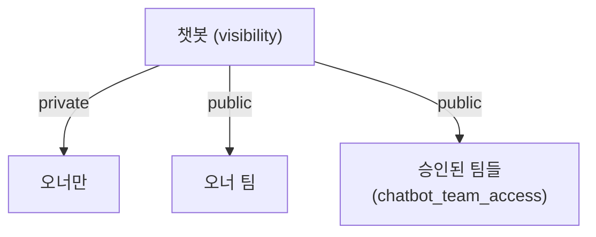
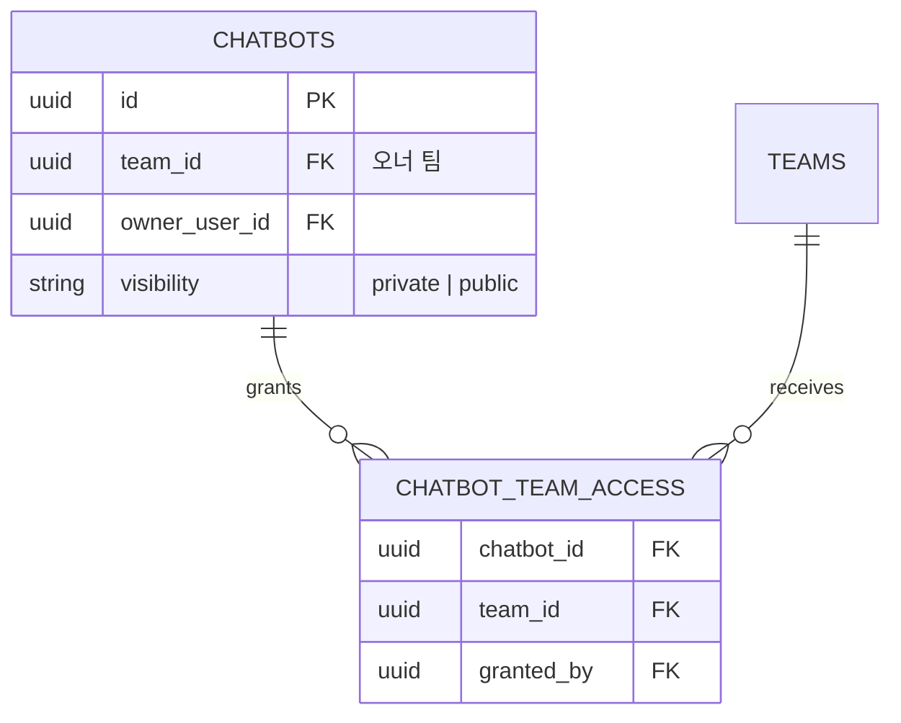

# 챗봇 교차팀 공유 (Cross-Team Sharing)

> 특정 팀이 만든 RAG 챗봇을 **다른 팀도 사용**할 수 있게 하는 설계. 기존 `visibility ∈ {private, public}` 구조를 그대로 유지하고, `public` 의 도달 범위를 **"승인된 팀"**으로 제한합니다. **설계 단계** 문서이며 DB/코드 적용은 후속 작업입니다.

## 1. 왜 필요한가

- 인사팀 "인사 규정 봇"을 영업팀도 그대로 쓰고 싶다.
- 다만 **원본 문서에는 접근 권한을 주지 않는다** — 챗봇을 통한 질의응답만 허용.
- 전사 공개(아무 팀이나 사용)를 기본값으로 두지 않는다 — 꼭 사용해야 할 팀만 오너가 **승인**해 공유한다.

## 2. 가시성 규칙 (단순화)

| visibility | 사용 가능한 사용자 |
| ---------- | ----------------- |
| `private` | 오너(`owner_user_id`)만 |
| `public` | **오너의 팀** + `chatbot_team_access`에 등록된(= 오너가 승인한) **팀들의 구성원** |



- 오너 팀은 **항상** 접근 가능(묵시). 별도 레코드 필요 없음.
- 승인 리스트가 비어 있으면 `public`은 **기존 동작과 동일**(오너 팀만 사용 가능).
- 타 팀 추가/제거는 오너 또는 오너 팀의 `team_admin` 이상만 수행 가능.

호환성: 기존 `public` 값은 그대로 유지. enum 확장 불필요.

## 3. 데이터 모델

### 3.1 신규 테이블 — `chatbot_team_access`

```
chatbot_team_access
┌────────────┬──────────────────────────────────────────┐
│ id │ UUID PK │
│ chatbot_id │ UUID FK chatbots.id ON DELETE CASCADE │
│ team_id │ UUID FK teams.id ON DELETE CASCADE │
│ granted_by │ UUID FK users.id │
│ created_at │ TIMESTAMP │
│ UNIQUE (chatbot_id, team_id) │
└────────────┴──────────────────────────────────────────┘
```

- `visibility=public` 일 때만 의미 있음. `private` 이면 무시(또는 서버가 무효 레코드로 거절).
- `chatbot` 삭제 시 cascade. 팀 삭제 시에도 cascade 후 공유 자동 해제.

### 3.2 ERD 조각



## 4. 권한 매트릭스

| 작업 | 오너 | 오너 팀의 team_admin | 승인된 타 팀 팀원 | 미승인 타 팀 | super_admin |
| ---- | :---: | :---: | :---: | :---: | :---: |
| 대화 시작 (`public`) | | | | ❌ | |
| 대화 시작 (`private`) | | ❌ | ❌ | ❌ | |
| 프롬프트/문서/도구 편집 | | | ❌ | ❌ | |
| `public`↔`private` 전환 | | | ❌ | ❌ | |
| 승인 팀 추가/제거 | | | ❌ | ❌ | |
| 소유 문서 **직접 다운로드** | | | ❌ | ❌ | |

핵심 — **챗봇 응답은 허용, 원본 문서 접근은 허용하지 않음.**

## 5. 권한 체크 로직

`services/chatbot_service.py::get_chatbot_for_user()`:

```python
if chatbot.visibility == ChatbotVisibility.private:
 allowed = chatbot.owner_user_id == user.id or user.role == UserRole.super_admin
elif chatbot.visibility == ChatbotVisibility.public:
 if chatbot.team_id == user.team_id:
 allowed = True
 else:
 allowed = await _team_has_access(db, chatbot.id, user.team_id)
else:
 allowed = False
```

내 접근 가능 챗봇 목록(`GET /chatbots`):

```sql
WITH me AS (SELECT :user_id::uuid AS uid, :team_id::uuid AS tid)
SELECT c.*
 FROM chatbots c, me
 WHERE c.owner_user_id = me.uid
 OR (c.visibility = 'public' AND c.team_id = me.tid)
 OR (c.visibility = 'public'
 AND EXISTS (
 SELECT 1 FROM chatbot_team_access a
 WHERE a.chatbot_id = c.id AND a.team_id = me.tid
 ))
 ORDER BY c.updated_at DESC;
```

## 6. RAG 스코프와의 상호작용

`rag_scope=linked_only` — 오너가 명시적으로 연결한 문서만. **교차팀 공유의 권장 기본값**(오너 팀 문서가 다른 팀에 새 나가지 않도록 명확히 통제).

`owner_visible`/`team_all` — 공유된 챗봇에서 사용 시 UI에서 **경고** 표시(오너가 볼 수 있는 문서 전체가 타 팀의 질의 결과에 인용될 수 있음). 명시적으로 덮어써야 저장 허용.

## 7. API

| 메서드 | 경로 | 설명 |
| ------ | ---- | ---- |
| `GET` | `/chatbots` | 내가 접근 가능한 목록(오너 + 오너 팀 public + 승인 받은 public) |
| `PATCH`| `/chatbots/{id}` | `visibility` 토글 |
| `GET` | `/chatbots/{id}/shares` | 현재 승인된 팀 목록 (team_admin+) |
| `PUT` | `/chatbots/{id}/shares` | 승인 팀 리스트 **교체** |
| `POST` | `/chatbots/{id}/shares/{team_id}` | 단일 팀 **추가** |
| `DELETE` | `/chatbots/{id}/shares/{team_id}` | 단일 팀 **해제** |

요청 예:

```http
PUT /chatbots/{id}/shares
{ "team_ids": ["<team-uuid-1>", "<team-uuid-2>"] }
```

`private` 챗봇에 공유 팀을 추가하려 하면 `400 visibility=public 이어야 합니다.` 응답.

## 8. UI 변경

- `/chatbots/[id]` 편집 "기본" 탭:
 - 가시성 라디오: `🔒 Private` · `👥 Public`
 - `Public` 선택 시 하단에 **승인된 팀** 멀티셀렉트가 펼쳐짐. 체크 변경 시 `/shares` 호출.
- `/chatbots` 목록 뱃지:
 - 내가 만든 챗봇: `🔒 Private` / `👥 Public (n개 팀 승인)`
 - 승인 받아 보이는 챗봇: `🤝 공유 받음 · ○○팀`

## 9. 감사 · 책임 추적

- `chatbot_team_access.granted_by` — 누가 어떤 팀에 승인했는지 기록.
- `Conversation.chatbot_id`로 "A팀 챗봇을 B팀원이 사용"한 대화를 사후 조회 가능.
- `/team/audit/conversations` 는 본인 팀 소속 사용자의 대화만 반환 → 오너 팀이 타 팀 대화를 들여다볼 수 없음(개인정보 경계). 필요 시 별도 "공유 챗봇 열람" 권한 플래그를 추가.

## 10. 마이그레이션 단계

1. `chatbot_team_access` 테이블 신설(cascade FK 포함).
2. 서비스 계층(`chatbot_service`, `chatbot_rag`)에 팀 접근 체크 로직 주입.
3. 기존 `public` 챗봇은 변경 없이 **오너 팀 전용**으로 계속 동작.
4. 프론트에 `/chatbots/[id]/shares` UI 추가.
5. (선택) 감사 화면에 "공유 챗봇 대화" 필터 제공.

## 11. 오픈 이슈

- **LLM 비용 귀속** — A팀 챗봇을 B팀이 쓰면 비용은 누구 부담? → `conversations.owner_team_id` 컬럼으로 집계 기준 분리 검토.
- **Rate-limit** — 챗봇/팀/사용자 중 어디서 제한할지 결정.
- **지식 차단(mute)** — 공유 받은 팀이 특정 문서를 답변에서 배제하고 싶은 경우 `chatbot_documents.muted_team_ids` 등 후속 확장.
- **승인 취소 시** — 진행 중인 대화에 어떻게 반영할지(즉시 차단 vs. 새 메시지부터 차단) 정책 결정.
