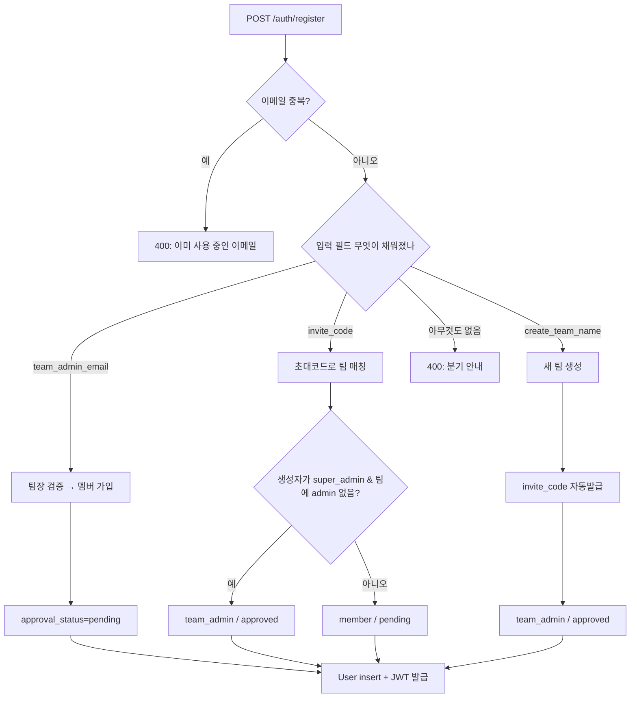

# auth — 로그인/가입/승인

`backend/app/features/auth/router.py` (231줄). 사용자 등록·로그인·세션·내 정보·내 팀 조회 5개 엔드포인트를 한 파일에 모은 단순한 구조지만, 가입 흐름은 3가지 분기(팀장 이메일 / 초대 코드 / 신규 팀 생성) 가 섞여 있어 한 번 읽고 가야 헷갈리지 않습니다.

## 1. 외부 API

| 메서드 | 경로 | 설명 |
|---|---|---|
| POST | `/auth/register` | 가입 — 세 분기에 따라 즉시 승인 or 대기 |
| POST | `/auth/login` | 로그인 — JWT 반환 |
| POST | `/auth/logout` | 204 — JWT 무상태이므로 서버 동작 없음 |
| GET  | `/auth/me` | 토큰 → 본인 정보 |
| GET  | `/auth/team` | 본인이 속한 팀 |

요청/응답 스키마는 `app/schemas.py` — `UserCreate`, `UserLogin`, `TokenResponse`, `UserOut`, `TeamOut`.

## 2. 가입 분기 (3가지)



### 2-1. 팀장 이메일 분기 (`router.py:47-75`)

가장 흔한 케이스 — 이미 만들어진 팀에 합류:

```python
admin_res = await db.execute(
    select(User).where(
        User.email == admin_email,
        User.role.in_([UserRole.team_admin, UserRole.super_admin]),
        User.approval_status == ApprovalStatus.approved,
        User.is_active.is_(True),
    )
)
team_admin = admin_res.scalar_one_or_none()
```

`team_admin` 도 `super_admin` 도 팀장으로 인정합니다. 두 명 이상 일치하는 일은 이론적으로 없음(email unique), 그러나 `scalar_one_or_none` 으로 방어.

가입은 **항상 pending** — 팀장이 `/admin` 콘솔에서 승인하기 전에는 로그인 불가.

### 2-2. 초대 코드 분기 (`router.py:76-98`)

팀의 `invite_code` 컬럼(`secrets.token_urlsafe(12)`) 으로 매칭. 의도된 부트스트랩 경로 — super_admin 이 만든 팀에 첫 team_admin 이 들어올 때:

```python
if invited_by and invited_by.role == UserRole.super_admin:
    has_admin = (await db.execute(...team admin exists check...)).scalars().first()
    if has_admin is None:
        role = UserRole.team_admin
        approval = ApprovalStatus.approved
```

즉 **팀에 admin 이 아직 없을 때만** 첫 가입자가 자동으로 team_admin 이 됩니다. 두 번째 사람부터는 일반 member + pending.

### 2-3. 새 팀 생성 분기 (`router.py:99-117`)

super_admin 이 자기 팀을 만드는 시나리오. 슬러그 충돌 회피로 50번까지 `-1`, `-2` 시도:

```python
for n in range(0, 50):
    cand = slug if n == 0 else f"{base}-{n}"
    taken = await db.execute(select(Team).where(Team.slug == cand))
    if not taken.scalar_one_or_none():
        slug = cand
        break
```

그리고 새 팀 + 신규 invite_code 발급. 생성자는 자동으로 `team_admin` + `approved`.

## 3. 로그인 (`router.py:173-202`)

```python
res = await db.execute(select(User).where(User.email == payload.email))
user = res.scalar_one_or_none()
if not user or not verify_password(payload.password, user.hashed_password):
    raise HTTPException(status_code=401, detail="이메일 또는 비밀번호가 올바르지 않습니다.")
if not user.is_active:
    raise HTTPException(status_code=403, detail="비활성화된 계정입니다.")
if user.approval_status == ApprovalStatus.rejected:
    raise HTTPException(status_code=403, detail="가입이 반려된 계정입니다. 관리자에게 문의하세요.")
if user.approval_status == ApprovalStatus.pending:
    raise HTTPException(status_code=403, detail="관리자 승인 대기 중입니다.")
```

**401 / 403 구분** 을 유의 — 401 은 "이메일/비밀번호 잘못", 403 은 "본인 맞지만 계정 상태가 문제". 프론트는 두 상태를 다르게 안내합니다.

성공 시 JWT 발급:

```python
token = create_access_token(
    str(user.id),
    claims={
        "role": user.role.value,
        "team_id": str(user.team_id) if user.team_id else None,
        "approval": user.approval_status.value,
    },
)
```

`role`/`team_id` 가 토큰 안에 들어 있어서 매 요청 DB 조회 없이 RBAC 가드를 1차로 거를 수 있습니다(2차는 `get_current_user` 가 DB 로 검증). 토큰 만료는 `core/security.py` 의 `ACCESS_TOKEN_EXPIRE_MINUTES`.

## 4. 로그아웃 (`router.py:205-212`)

```python
@router.post("/logout", status_code=204)
async def logout() -> None:
    """현재 구현은 상태 없는 JWT 이므로 서버에 남길 작업이 없습니다."""
    return None
```

**의도된 무동작**. 프론트는 그래도 호출해서 감사 로그 / 추후 블랙리스트 확장 여지를 남겨둡니다. 블랙리스트가 필요해지면 Redis 에 jti 저장 + middleware 에서 확인.

## 5. 함정·결정

- **pending 사용자도 토큰을 받지만 빈 access_token** (`router.py:147-150`) — 프론트가 이걸 보고 "승인 대기" 화면을 띄움. 실수로 빈 토큰을 localStorage 에 넣으면 `getToken()` 이 truthy 처리할 수 있으니, 프론트는 빈 문자열도 falsy 로 다룸.
- **`_slugify`** 가 한글을 살리지 않음 (`re.sub(r"[^\w\s-]", "")` + `flags=re.UNICODE`) — `\w` 가 unicode 단어 클래스라 한글은 살아남습니다. 영문화 안 함이 의도.
- **이메일 normalization 가 일관되지 않음** — `team_admin_email` 만 `.strip().lower()`, 등록 이메일은 schema 의 `EmailStr` 검증만. 사용자 입력이 대소문자 다르면 매칭 실패할 수 있음. 후속 작업 대상.

## 관련

- 토큰 생성/검증 — `core/security.py`
- `get_current_user` — `core/deps.py` (RBAC 가드의 출발점)
- 부트스트랩 admin 자동 생성 — `services/bootstrap_admin.py` (lifespan 에서 호출)
- 사용자 관리 (승인·역할 변경) — [backend-misc](backend-misc.md)
