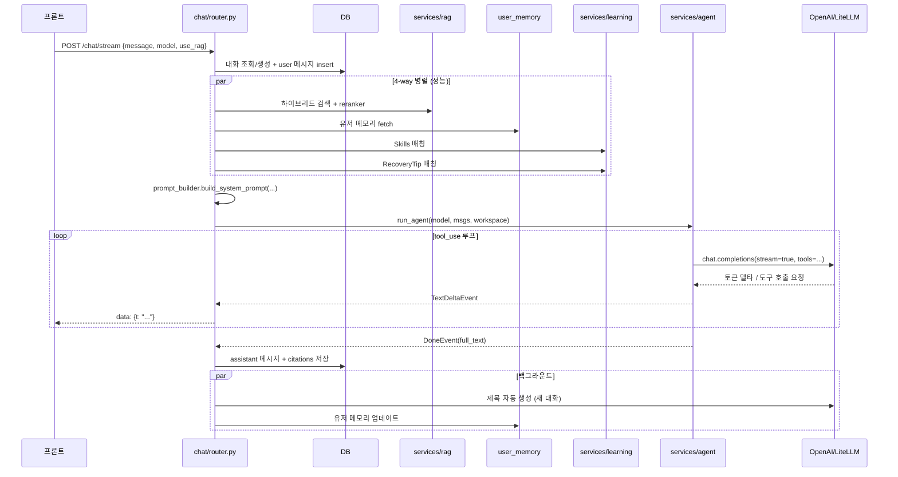

# chat — SSE 스트리밍 + 에이전트 루프

`backend/app/features/chat/router.py` (642줄). 시스템의 심장 — 사용자가 보낸 메시지를 받아 RAG·메모리·스킬·복구팁을 컨텍스트로 만들고, LLM 에 흘려보내며, 응답을 토큰 단위로 프론트에 SSE 로 푸시하는 한 줄짜리 엔드포인트 뒤에 100여 줄의 정교한 파이프라인이 숨어 있습니다.

## 1. 외부 API

| 메서드 | 경로 | 설명 |
|---|---|---|
| POST | `/chat/stream` | SSE 스트림 — `text/event-stream` 으로 응답 |

요청 본문(`ChatStreamIn`, `router.py:327-335`):
```python
class ChatStreamIn(BaseModel):
    conversation_id: UUID | None = None
    chatbot_id: UUID | None = None
    model: str  # LiteLLM 모델 문자열 (e.g. "openai/gpt-4o")
    message: str
    use_rag: bool = True
    image_base64: str | None = None
    image_media_type: str | None = None
    files: list[FileAttachment] | None = None
```

응답은 SSE — 각 줄이 `data: {...}\n\n`. 이벤트 종류:
- `{citations: [...]}` — RAG 인용 카드 (스트리밍 전에 우선 전송)
- `{step_start: {n, tools}}` / `{step_end: {n, tools}}` — agent step 시작·종료
- `{t: "..."}` — 토큰 델타
- `{sandbox: {...}}` — 코드 인터프리터 출력
- `{image: {...}}` — DALL·E 결과
- `{pending_schedule: {...}}` — 예약 작업 큐잉 알림
- `{error: "..."}` — 오류

프론트는 `frontend/app/(workspace)/chat/page.tsx` 의 fetch + ReadableStream 으로 이 줄을 한 줄씩 읽어 UI 갱신.

## 2. 전체 흐름



## 3. 코드 한 토막씩

### 3-1. 이벤트 → SSE 변환기 (`router.py:76-111`)

```python
def _event_to_sse(event, buf: list[str], pending: list[dict] | None = None) -> str | None:
    if isinstance(event, StepStartEvent):
        return f"data: {json.dumps({'step_start': {'n': event.step, 'tools': event.tools}}, ensure_ascii=False)}\n\n"
    if isinstance(event, TextDeltaEvent):
        buf.append(event.text)
        return f"data: {json.dumps({'t': event.text}, ensure_ascii=False)}\n\n"
    if isinstance(event, DoneEvent):
        buf.clear()
        buf.append(event.full_text)
        return None  # done은 최종 yield에서 처리
    ...
```

agent 의 dataclass 이벤트를 dict → JSON → SSE 한 줄로 변환. `buf` 는 호출자(라우터)가 들고 있는 누적 버퍼 — DoneEvent 가 오면 `buf` 를 비우고 full text 로 교체. 이 한 가지 규약 덕분에 라우터는 "DoneEvent 이후 buf 가 곧 최종 답변" 이라고 믿을 수 있음.

### 3-2. 4-way 병렬 컨텍스트 준비 (`router.py:213-244`)

```python
async def _prepare_context(...):
    rag_task = _run_rag_pipeline(...) if use_rag else _noop_rag()
    memory_task = _safe_get_memory(db, user.id, rid)
    skills_task = _safe_match_skills(db, team_id, query, rid)
    recovery_task = _safe_match_recovery(db, team_id, query, rid)

    (rag_context, citations), user_memory, skills_section, recovery_section = await asyncio.gather(
        rag_task, memory_task, skills_task, recovery_task,
    )
    return rag_context, user_memory, citations, skills_section, recovery_section
```

서로 독립적인 4가지(검색·메모리·스킬·복구팁) 를 `asyncio.gather` 로 동시 실행. 각각 RTT 200-500ms 라 직렬로 하면 1.5-2s, 병렬이면 max(개별) ≈ 500ms.

모든 task 가 `_safe_*` 래퍼로 try/except — **하나가 죽어도 다른 컨텍스트는 살아 통과**.

### 3-3. RAG 파이프라인 (`router.py:139-182`)

```python
async def _run_rag_pipeline(db, user, team_id, query, rid):
    s = get_settings()
    if s.rag_hyde_enabled:
        q_emb = await embed_query_with_hyde(query, user_id=user.id, team_id=team_id, alpha=s.rag_hyde_alpha)
    else:
        q_emb = (await embed_texts([query], team_id=team_id, user_id=user.id))[0]
    pool = s.rerank_candidates if s.rerank_enabled else 0
    chunk_ids = await hybrid_search_chunk_ids(db, user_id=user.id, team_id=team_id, query=query, query_embedding=q_emb, pool_size=pool)
    rows = await fetch_chunk_contents(db, chunk_ids)

    if s.rerank_enabled and rows:
        scored = await rerank(query, rows, team_id=team_id, user_id=user.id)
        kept = gap_cutoff_scores(scored, max_n=s.rag_final_top_k)
        ...

    rag_context, citations = build_numbered_context(rows, scores=score_map)
    return rag_context, citations
```

세 단계:
1. **임베딩** — HyDE(가설답변 → 임베딩) 또는 직접 임베딩
2. **하이브리드 검색** — pgvector HNSW + lexical (`ts_query`) + RRF (Reciprocal Rank Fusion)
3. **LLM 재랭커** — (질문, 청크) 별 0-10 점수 → gap cutoff 으로 진짜 관련 있는 것만

설정에 따라 단계를 끌 수 있게 분기. 빈 결과여도 try 가 잡고 `""`, `[]` 반환.

### 3-4. 대화 생성/조회 (`router.py:353-379`)

```python
if payload.conversation_id:
    conv = await db.get(Conversation, payload.conversation_id)
    if not conv or conv.user_id != user.id:
        raise HTTPException(404, "대화를 찾을 수 없습니다.")
    # 기존 대화의 chatbot 고정 — 요청값이 다르면 기존 대화의 값을 유지
    if conv.chatbot_id is not None:
        chatbot = await db.get(Chatbot, conv.chatbot_id)
else:
    is_new_conv = True
    conv = Conversation(...)
    db.add(conv)
    await db.flush()

db.add(Message(conversation_id=conv.id, role="user", content=payload.message, ...))
await db.commit()
```

**대화 안에서 chatbot 은 불변** 이 의도된 규칙. 사용자가 도중에 다른 챗봇으로 바꾸려 해도 새 대화를 시작해야 합니다. 그래야 시스템 프롬프트가 일관되고 RAG 스코프가 흔들리지 않음.

### 3-5. 모델 economy routing (`router.py:391-395`)

```python
effective_model = pick_economy_model(
    requested_model, payload.message, has_tools_needed=False
)
if effective_model != requested_model:
    log.info("[%s] economy routing: %s → %s", rid, requested_model, effective_model)
```

"안녕", "고마워" 같은 단순 응답엔 자동으로 mini 모델 다운그레이드. `services/efficiency.py` 의 휴리스틱 — 메시지 길이 + 키워드 + 도구 필요 여부. 절약 효과 큼.

### 3-6. SSE 응답 생성기 (`router.py:469-`)

```python
async def gen():
    buf: list[str] = []
    pending_schedules: list[dict] = []
    t_start = time.perf_counter()
    # 인용 카드를 먼저 프론트로 푸시 → 답변 스트리밍 전 우측 패널 준비
    if citations:
        yield f"data: {json.dumps({'citations': citations}, ensure_ascii=False)}\n\n"
    try:
        if not use_tools:
            # ollama 같은 도구 미지원 모델 — stream_chat 직접 호출
            configure_env()
            async for delta in stream_chat(model, llm_messages):
                buf.append(delta)
                yield f"data: {json.dumps({'t': delta}, ensure_ascii=False)}\n\n"
        else:
            ws = Workspace(files=attached_files, ...)
            async for event in run_agent(model, llm_messages, ws):
                sse = _event_to_sse(event, buf, pending_schedules)
                if sse:
                    yield sse
        full = "".join(buf)
        await _save_and_postprocess(conv_id, model, user_id, user_text, full, hist_rows, is_new_conv, citations=citations, pending_schedules=pending_schedules)
```

**두 갈래** — 도구 지원 모델은 `run_agent` (agent.py 의 tool_use 루프), 미지원은 `stream_chat` 단일 호출. 두 경로가 같은 `buf` 규약을 따르도록 설계.

`_save_and_postprocess` 는 응답 저장 + 새 대화면 제목 자동 생성 + 유저 메모리 업데이트를 `asyncio.create_task` 로 백그라운드 발송 — **응답 종료 latency 영향 0**.

## 4. agent.run_agent 의 내부 (services/agent.py)

라우터가 호출하는 `run_agent(model, llm_messages, ws)` 가 실제 OpenAI tool_use 루프입니다. 핵심 골격:

```python
async def run_agent(model, messages, ws: Workspace) -> AsyncIterator[Event]:
    for step in range(MAX_STEPS):
        yield StepStartEvent(step, tools=ws.tool_names)
        stream = await litellm.acompletion(model=model, messages=messages, tools=tools, stream=True)
        async for delta in stream:
            if delta.text:
                yield TextDeltaEvent(delta.text)
            if delta.tool_calls:
                tool_result = await ws.execute_tool(...)
                messages.append({"role": "tool", "tool_call_id": ..., "content": ...})
                break  # 다음 step 으로
        else:
            yield DoneEvent(full_text=...)
            return
        yield StepEndEvent(step, tools=...)
```

- `MAX_STEPS` 로 무한 루프 방지 (보통 6)
- 도구 실행은 `Workspace.execute_tool` — ToolRegistry 가 슬러그로 실행
- 도구 결과를 메시지에 append 한 다음 step 을 다시 호출하는 패턴이 OpenAI tool_use spec

상세는 `services/agent.py` 직접 참조. 도구 도입은 [backend-misc](backend-misc.md).

## 5. 함정·결정

- **citations 를 가장 먼저 전송** — 프론트가 우측 인용 패널을 미리 그릴 수 있게. 답변 본문이 끝난 뒤 보내면 UX 가 어색.
- **db 세션은 한 요청에 1개** 이지만 `_save_and_postprocess` 는 `SessionLocal()` 로 새 세션을 엽니다 — 요청 응답 후에도 동작해야 하므로. 같은 세션을 쓰면 응답 종료 시 닫혀 commit 실패.
- **economy routing 의 has_tools_needed=False** — 보수적으로 False 고정. 실제론 LLM 이 도구를 부를지 모르지만, 다운그레이드는 짧은 인사용. 만약 GPT-4 가 도구를 부르려는데 mini 로 강제됐다면 일반 응답으로 처리되도록 `_supports_tools` 가 한 번 더 가드.
- **24개 메시지 히스토리 제한** (`hist_rows .limit(24)`) — token budget 보호. 더 많이 보내고 싶으면 컨텍스트 윈도우 확인.

## 관련 문서

- 시스템 프롬프트 조립 — `features/chat/prompt_builder.py`
- 도구 시스템 — [backend-misc](backend-misc.md)
- RAG 상세 — [documents 워크스루](backend-documents.md)
- 학습 시스템 (Skills / RecoveryTip) — `services/learning.py`
- 토큰 계측 — `services/metrics.py`
