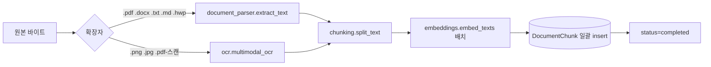

# documents — 업로드부터 임베딩까지

## 1. 라우터 (`features/documents/router.py`)

엔드포인트:

| 메서드 | 경로 | 설명 |
|---|---|---|
| POST | `/documents/upload` | multipart 다중 파일 + scope=team\|private → Document 생성 → 백그라운드 잡 큐잉 |
| GET  | `/documents` | 본인 + 팀 공유 + DocumentShare 받은 것 |
| GET  | `/documents/{id}/download` | 원본 파일 스트리밍 (Content-Disposition: attachment) |
| DELETE | `/documents/{id}` | soft 비교 없이 진짜 DELETE — cascade 로 청크/공유 함께 |

핵심 한 줄: 파일 저장 → DB row 생성 → `asyncio.create_task(process_document_job(doc.id))` — 업로드 응답은 200 즉시. 처리 결과는 클라이언트가 폴링.

## 2. 파이프라인 (`services/ingest.py`)



`process_document_job(document_id)` 가 한 함수 — try 안에서 4단계, 실패 시 status='failed' + error_message 기록.

### 2-1. 파서 분기 (`document_parser.py`)

- `.pdf` → `pdfminer.high_level.extract_text` (텍스트 PDF). 스캔 이미지 비율이 높으면 OCR 로 fallback.
- `.docx` → `python-docx` (paragraphs + tables)
- `.hwp / .hwpx` → `hwp5` 라이브러리 (한컴 한글 — 한국 기업 문서 필수)
- `.txt / .md` → `utf-8` 디코딩
- 이미지 → `multimodal_ocr` (OpenAI vision 으로 텍스트 추출)

### 2-2. 청킹 (`chunking.py`)

- 토큰 기준 (tiktoken `cl100k_base`) 1000 토큰 ± overlap 100.
- 문단 경계 우선 → 너무 짧으면 인접 청크 병합.
- 짧은 청크(<50 토큰) drop — 임베딩 비용 낭비 방지.

### 2-3. 임베딩 (`embeddings.py`)

- OpenAI `text-embedding-3-small` (1536d). 배치 사이즈 100.
- 호출 실패 시 백오프 후 재시도. 영구 실패 시 `_mark_document_failed`.
- 차원이 pgvector HNSW 인덱스 차원과 일치해야 함 (스키마 1536 고정).

### 2-4. 저장

```python
# DocumentChunk 한 번에 add_all → flush
db.add_all([
    DocumentChunk(
        document_id=doc.id,
        chunk_index=i,
        content=chunk,
        token_count=tk,
        embedding=emb,
    )
    for i, (chunk, tk, emb) in enumerate(zip(chunks, token_counts, embeddings))
])
```

PostgreSQL 의 트랜잭션 안에서 한 번 commit. 100청크짜리 파일도 1초 미만.

## 3. 함정·결정

- **업로드 응답 즉시 200** — 클라이언트는 `/documents` 폴링으로 status 확인. UI 는 status='processing' 일 동안 스피너.
- **OCR 가격 위험** — 큰 PDF 가 전부 스캔이면 비용 폭주. `services/ingest.py` 의 `_should_ocr` 가 페이지의 텍스트 추출 길이로 1차 분기.
- **삭제는 진짜 DELETE** — Document 가 사라지면 DocumentChunk 가 cascade. 복구 불가. 휴지통 UI 가 필요해지면 soft delete 컬럼 추가 검토.
- **인덱싱 동시성** — process_document_job 은 `SessionLocal()` 로 새 세션. 같은 문서가 두 번 큐잉되면 둘 다 insert 시도 → IntegrityError 잡고 종료.

## 관련

- 검색 — `services/rag.py` (하이브리드) + `services/rag_hyde.py` (HyDE)
- 챗봇별 RAG 범위 가드 — `services/chatbot_rag.py`
- 청크 모델 — [models 워크스루](backend-models.md) 의 DocumentChunk
