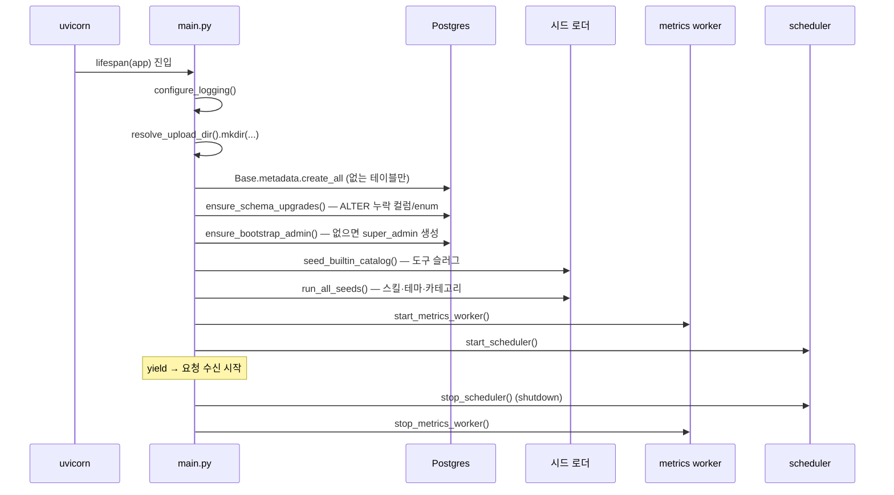

# main · 부팅 흐름

`backend/app/main.py` — FastAPI 앱 생성 + 라우터 등록 + 부팅 시 1회 수행되는 초기화 묶음. 한 화면 안에 들어오는 짧은 파일이지만, 서버가 살아 움직이는 데 필요한 모든 단계가 여기에 모여 있습니다.

## 1. 무엇을 하는가

서버 프로세스가 처음 떴을 때:
1. 로깅 포맷을 잡고
2. 업로드 디렉터리를 만들고
3. ORM 테이블을 (없으면) 생성하고
4. 누락된 컬럼/Enum 값을 자동 보정하고
5. 부트스트랩 관리자 계정을 (없으면) 만들고
6. 도구 카탈로그 / 스킬·테마·카테고리 등 시드 데이터를 적재하고
7. 지표 워커와 스케줄러를 띄운 뒤
8. `yield` — 그 후 모든 HTTP 요청을 받기 시작합니다.

종료 시엔 위 순서를 뒤집어 정리합니다.

## 2. 외부에서 보이는 모양

- HTTP 엔드포인트 3개가 main.py 자체에 박혀 있음 — `/`, `/health`, `/favicon.ico`.
- 나머지는 모두 `features/<area>/router.py` 의 라우터를 `include_router` 로 마운트.

## 3. 부팅 흐름



## 4. 코드 한 줄씩

### 4-1. 라이프스팬 (`main.py:47-89`)

```python
@asynccontextmanager
async def lifespan(_app: FastAPI):
    settings = get_settings()
    resolve_upload_dir(settings).mkdir(parents=True, exist_ok=True)
    async with engine.begin() as conn:
        await conn.run_sync(Base.metadata.create_all)
```

`get_settings()` 는 `app/core/config.py` 의 `@lru_cache` 로 한 번만 평가됩니다.
`Base.metadata.create_all` 은 **기존 테이블을 절대 건드리지 않고**, 누락된 테이블만 만듭니다. 그래서 운영 중 컬럼 추가는 `ensure_schema_upgrades()` 가 따로 해줍니다.

```python
try:
    await ensure_schema_upgrades()
except Exception:
    logger.exception("스키마 자동 업그레이드 중 오류(서버는 계속 실행됩니다)")
```

이 try/except 패턴이 **부팅 단계마다 반복**되는 게 의도된 디자인입니다 — 한 단계가 실패해도 다른 단계는 계속 진행. 예를 들어 스케줄러가 죽었다고 해서 채팅 API 가 안 뜨는 사태는 막습니다. 단, 결정적 단계(테이블 생성)는 try 밖에 있어서 정말 죽어야 하면 죽도록 했습니다.

### 4-2. 부트스트랩 관리자 (`main.py:58-61`)

```python
await ensure_bootstrap_admin()
```

`services/bootstrap_admin.py` 가 `.env` 의 `BOOTSTRAP_ADMIN_EMAIL` / `BOOTSTRAP_ADMIN_PASSWORD` 를 읽어 — 이미 있는 사용자면 패스, 없으면 `role='super_admin'` 으로 생성합니다. 신규 환경 셋업이 단순해지는 핵심 한 줄.

### 4-3. 시드 로더 (`main.py:62-70`)

```python
await seed_builtin_catalog()      # 도구
result = await run_all_seeds()    # 스킬·테마·카테고리·…
logger.info("시드 데이터 로드 완료: %s", result)
```

서비스 운영의 "기본값"을 코드/YAML 에서 DB 로 동기화합니다. 시드는 **id 충돌 시 upsert** 이므로 재실행해도 안전합니다. 이 덕분에 새 환경에서도 빈 DB 위에 한 번 띄우면 도구 마켓·스킬 마켓이 이미 채워져 있습니다.

### 4-4. 워커·스케줄러 (`main.py:71-78`)

- `start_metrics_worker()` — `usage_events` 큐를 비동기로 비웁니다. 채팅 응답 hot path 에서 DB write 가 응답을 지연시키지 않게 큐로 분리.
- `start_scheduler()` — APScheduler `AsyncIOScheduler` 시작. 등록된 ScheduleEntry 들의 cron 트리거 실행.

이 둘은 try/except 로 감싸 부팅 자체를 막진 않지만, 실패하면 비용/스케줄 기능이 silently 망가집니다. 운영 시 `app.warning` 이상 로그를 알람 연동하세요.

### 4-5. FastAPI 인스턴스 (`main.py:92-107`)

```python
app = FastAPI(title="장금상선 그룹 챗봇 API", version="0.2.0", lifespan=lifespan)
register_exception_handlers(app)
app.add_middleware(
    CORSMiddleware,
    allow_origins=[
        "http://localhost:3000", "http://127.0.0.1:3000",
        "http://localhost:3001", "http://127.0.0.1:3001",
        "http://10.x.x.x:3001",
    ],
    allow_credentials=True,
    allow_methods=["*"],
    allow_headers=["*"],
)
app.add_middleware(RequestLoggingMiddleware)
```

CORS 화이트리스트는 dev 편의용 — 사내 LAN 의 다른 PC 가 직접 백엔드를 부르는 시나리오를 허용합니다. 실 운영에선 프론트가 `/api/*` 로 같은 origin 프록시를 거치므로 CORS 자체가 발생하지 않습니다 (`frontend/next.config.ts` 참고).

`RequestLoggingMiddleware` 는 모든 요청에 짧은 ID(`[xxxxxxxx]`) 를 부여 + 응답 시간 기록. 디버깅에 결정적.

### 4-6. 라우터 등록 (`main.py:109-126`)

```python
app.include_router(auth.router)
app.include_router(admin.router)
...
app.include_router(workflows.router)
```

순서는 의미 없지만, **prefix 가 겹치는 라우터가 없도록** features 디자인 시 신경 씁니다. 새 기능 추가 시 여기 한 줄 추가하는 게 가장 흔한 PR 패턴.

### 4-7. 정적 핸들러 (`main.py:129-147`)

```python
@app.get("/")
async def root(): ...

@app.get("/favicon.ico", include_in_schema=False)
async def favicon():
    return Response(status_code=204)

@app.get("/health")
async def health():
    return {"ok": True}
```

`/health` 는 모니터링·smoke test·테스트 conftest 셋업에 사용 — 절대 무거워지면 안 됩니다.

## 5. 함정·결정

- **`create_all` 만으로는 부족** — 컬럼 추가는 `ensure_schema_upgrades()` 의 ALTER 문 묶음으로. Alembic 안 쓰는 이유: 운영팀 1인이 dev 만들고 dev 가 곧 배포라, migration 파일 누적이 비용 대비 가치가 낮음. 단점은 ROLLBACK 가 어려움 — 컬럼 삭제는 신중히.
- **모든 부팅 단계가 try/except** — 의도된 패턴이지만, **silent 실패** 가 디버깅 지옥이 될 수 있음. 로그 레벨을 항상 `ERROR` 이상 모니터링.
- **lifespan 이 동기 sleep 을 갖지 않음** — 모든 단계가 짧아야 합니다(< 5초). 시드가 무거워지면 백그라운드 태스크로 옮기세요.

## 관련 문서

- [DB 모델 지도](backend-models.md) — `Base.metadata.create_all` 이 생성하는 13개 테이블
- [공통 의존성](backend-deps.md) — `get_settings`, `engine`, 인증 가드
- [auth 워크스루](backend-auth.md) — `ensure_bootstrap_admin` 의 실제 로직
