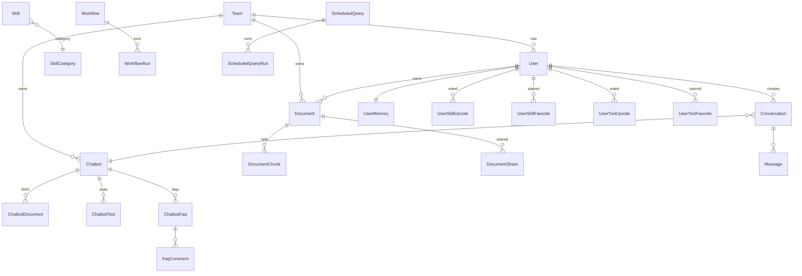

# DB 모델 지도

`backend/app/db/models.py` (1330줄). 30+ 개의 ORM 클래스가 도메인 순서로 나열돼 있습니다. 이 워크스루는 "어디에 무엇이 있고, 무엇이 무엇을 참조하는지" 만 한 화면에 보여드립니다. 컬럼 한 줄씩의 상세 정의는 [erd.md](../erd.md) 의 표를 참조하세요.

## 한눈에 보는 그룹

| 그룹 | 테이블 | 핵심 책임 |
|---|---|---|
| 인증·팀 | Team · User · UserMemory | 사용자·팀 + 역할/승인 + 자동 누적 메모리 |
| 문서 RAG | Document · DocumentChunk · DocumentShare · IngestJob | 파일 → 청크 → 임베딩 + 비동기 잡 큐 |
| 챗봇 | Chatbot · ChatbotDocument · ChatbotTool | 프로필 + 연결된 문서/도구 |
| 대화 | Conversation · Message | 대화 메타 + 메시지 |
| 도구 | Tool · ToolCredential | 슬러그 카탈로그 + (사내 도구의) 자격증명 |
| 스킬 | Skill · SkillCategory · UserSkillUpvote · UserSkillFavorite | 스킬 마켓 + 좋아요/즐겨찾기 |
| 워크플로 | Workflow · WorkflowRun | 노드/엣지 + 실행 이력 |
| Q&A | ChatbotFaq · FaqComment · FaqPost | 챗봇 FAQ · 공개 게시판 |
| 운영 | Notice · UsageEvent · TeamQuota · FailureLog · RecoveryTip | 공지·계측·쿼터·실패 학습 |
| 스케줄 | ScheduledQuery · ScheduledQueryRun | 예약 + 실행 이력 |
| 테마 | Theme | 브랜드 토큰 카탈로그 |

## 관계 다이어그램 (요약)



## 핵심 Enum

```python
class UserRole(str, enum.Enum):           # 31
    member · team_auditor · team_admin · super_admin

class ApprovalStatus(str, enum.Enum):     # 49
    pending · approved · rejected

class DocumentScope(str, enum.Enum):      # 55
    private · team

class ChatbotVisibility(str, enum.Enum):  # 66
    private · public

class ChatbotRagScope(str, enum.Enum):    # 71
    linked_only · owner_visible · team_all

class ToolKind(str, enum.Enum):           # 77
    builtin · mcp · user_http

class ToolSource(str, enum.Enum):         # 92
    builtin · mcp · user      # marketplace 카드 라벨

class ToolVisibility(str, enum.Enum):     # 84
    private · team · public

class FaqPostStatus(str, enum.Enum):      # 97
    open · answered · closed

class SkillSource / SkillVisibility       # 780·791
class WorkflowVisibility / RunStatus      # 1230·1236
class UsageEventKind                      # 553
class ScheduleTriggerType                 # 624
```

Enum 은 Postgres 의 진짜 ENUM 타입으로 마이그레이션됩니다(via `ensure_schema_upgrades`). VARCHAR 로 두지 않은 이유: 비교 조건 `User.role == UserRole.team_admin` 이 ENUM 캐스팅 없이 동작하길 원해서.

## 상세하게 살펴볼 가치가 있는 모델 5개

### User (`models.py:122-159`)

- `team_id` 가 nullable — super_admin 은 팀 없이도 존재할 수 있음 (cross-team 관리)
- `approval_status` 의 기본은 pending — 가입 시 자동으로 승인되는 분기([auth 워크스루](backend-auth.md))를 거치지 않으면 절대 로그인 못 함
- `hashed_password` — `services/security.py` 의 `hash_password` (passlib bcrypt)
- 인덱스: `(email)` unique, `(team_id, role)` for RBAC 가드

### Chatbot (`models.py:381-426`)

- `document_ids` / `tool_slugs` 가 PostgreSQL **ARRAY** 컬럼 — JSON 보다 인덱싱·쿼리 효율이 좋음. 단점: 부분 업데이트가 어려움 (PATCH 시 전체 교체)
- `rag_scope` — 챗봇이 검색할 수 있는 문서 범위. `linked_only` 가 가장 안전, `team_all` 은 팀 전체 문서.
- `is_active` 가 아닌 `visibility` 로 끄고 켬 — `private` 은 소유자만, `public` 은 같은 팀.

### Document / DocumentChunk (`models.py:160-241`)

- Document.scope = 'team' 이면 같은 팀 사용자가 모두 볼 수 있음.
- DocumentShare 테이블로 cross-team 공유도 가능 (super_admin 이 명시적으로 share).
- DocumentChunk.embedding 은 `pgvector.sqlalchemy.Vector` 타입 — HNSW 인덱스 with `vector_cosine_ops`.
- `content_tsv` 는 한국어 `simple` config 기반 ts_vector — 단순 lexical 검색용.

### Message (`models.py:273-292`)

- `role` 는 enum 이 아닌 VARCHAR — agent 가 tool 메시지를 자유로이 넣을 수 있게.
- `extra` JSONB 에 citations / pending_schedule / image_media_type 등 메타.
- `(conversation_id, created_at)` 인덱스로 히스토리 페이지네이션 빠르게.

### Workflow / WorkflowRun (`models.py:1244-1330`)

- `nodes` / `edges` / `variables` 모두 JSONB — 스키마 진화 자유롭게.
- `is_active` 가 아닌 `visibility` (private/team/public) 로 마켓 노출 분리.
- WorkflowRun.node_outputs JSONB — 노드별 status/output/error.
- `upvote_count` / `fork_count` 가 카운터 컬럼 (조회 부담 줄임).

## 함정·결정

- **Alembic 미사용** — 컬럼 추가는 `services/schema_upgrade.py` 의 raw ALTER 묶음. PR 머지 후 서버 재기동 시 자동 적용. 컬럼 **제거**는 자동화 안 함 — 운영 데이터 사고 방지.
- **JSONB vs ARRAY** — Chatbot.document_ids 는 ARRAY (인덱싱 우선), Message.extra 는 JSONB (스키마 자유). 둘의 기준을 섞지 말 것.
- **enum 변경 시** — `ALTER TYPE ... ADD VALUE` 만 가능, 제거 불가. 새 값 추가는 안전하지만 이름 변경은 마이그레이션 신중히.
- **soft delete 패턴** — `is_active` 컬럼이 있는 모델(User, Tool, Schedule…) 은 삭제 대신 비활성. 진짜 DELETE 는 admin 콘솔에서만.

## 관련 문서

- [erd.md](../erd.md) — 컬럼·타입·인덱스 전수 표
- [auth 워크스루](backend-auth.md) — User · Team 의 라이프사이클
- [documents 워크스루](backend-documents.md) — Document · Chunk · IngestJob 흐름
