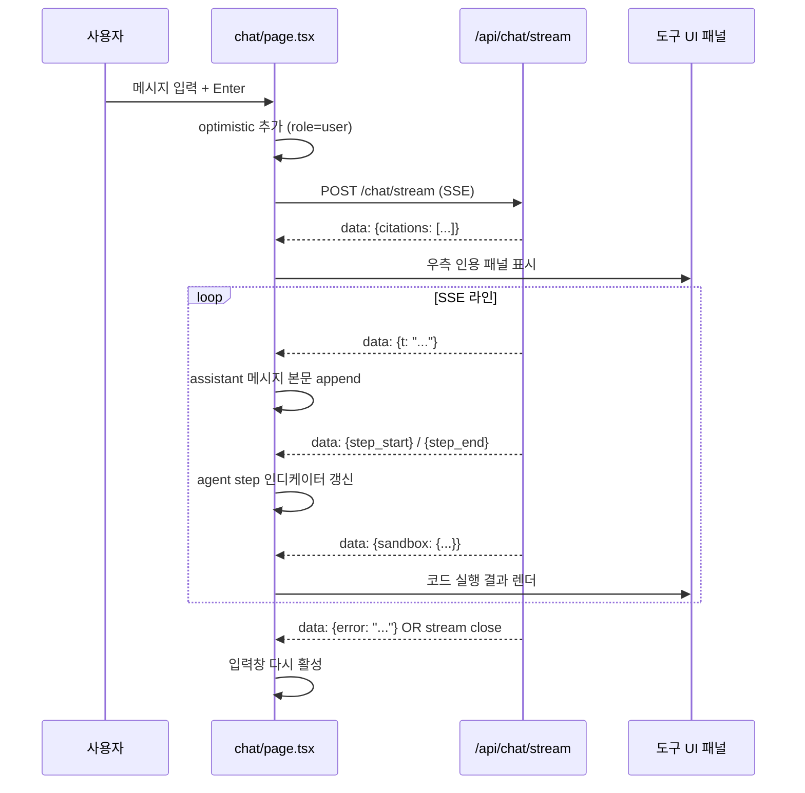

# 채팅 화면 — SSE 수신 흐름

`frontend/app/(workspace)/chat/page.tsx` (1108줄). 백엔드 [chat 워크스루](backend-chat.md) 와 짝을 이루는 클라이언트 — SSE 한 줄씩 받아 UI 를 점진적으로 갱신합니다.

## 1. 큰 그림



## 2. SSE 파서

```tsx
const res = await fetch("/api/chat/stream", {
  method: "POST",
  headers: { "Content-Type": "application/json", Authorization: `Bearer ${getToken()}` },
  body: JSON.stringify(payload),
});
if (!res.ok || !res.body) throw await ApiUserError.fromResponse(res);

const reader = res.body.getReader();
const decoder = new TextDecoder();
let buffer = "";

while (true) {
  const { value, done } = await reader.read();
  if (done) break;
  buffer += decoder.decode(value, { stream: true });
  while (true) {
    const idx = buffer.indexOf("\n\n");
    if (idx === -1) break;
    const line = buffer.slice(0, idx).trim();
    buffer = buffer.slice(idx + 2);
    if (!line.startsWith("data:")) continue;
    const json = line.slice(5).trim();
    if (!json) continue;
    const event = JSON.parse(json);
    handleEvent(event);
  }
}
```

핵심 한 줄: SSE 의 구분자는 `\n\n` — 줄 단위가 아니라 **빈 줄 단위**. 한 패킷이 여러 이벤트를 담을 수 있어 while 루프로 모두 처리.

## 3. handleEvent — 이벤트 분기

```tsx
function handleEvent(ev: any) {
  if (ev.citations) setCitations(ev.citations);
  if (ev.step_start) setAgentSteps(prev => [...prev, { n: ev.step_start.n, status: "running" }]);
  if (ev.step_end)   setAgentSteps(prev => updateLast(prev, "done"));
  if (ev.t)          appendToAssistant(ev.t);
  if (ev.sandbox)    setSandboxOutput(ev.sandbox);
  if (ev.image)      setImageResult(ev.image);
  if (ev.pending_schedule) setPendingSchedule(ev.pending_schedule);
  if (ev.error)      setStreamError(ev.error);
}
```

토큰 델타(`t`) 는 가장 빈번 — 매 호출이 React state setter. 너무 잦은 setState 가 렌더 지옥이라 **batch** 가 필요해질 수 있음 (현재는 React 18 의 자동 배칭에 맡김).

## 4. 좌측 사이드바

```
┌─ 대화 목록 ──────┐
│ + 새 대화         │
│ 검색…              │
│ ・어제의 대화     │
│ ・프로젝트 회의   │
├─ NoticeMiniList ─┤
├─ UsageMiniCard ──┤
└──────────────────┘
```

- `NoticeMiniList` — `GET /notices/latest?limit=3`
- `UsageMiniCard` — `GET /usage/me/summary?window=30d`
- 둘 다 features/ 디렉토리의 독립 컴포넌트.

## 5. 중앙 메시지 영역

- 각 메시지는 `role: 'user' | 'assistant' | 'system' | 'tool'` 로 다른 카드 스타일.
- assistant 의 본문은 **마크다운** — `react-markdown` + `remark-gfm` + `rehype-highlight`.
- assistant 의 카드 우측 하단에 **인용 카드** — citations 가 있을 때 표시. 클릭 시 원본 문서 열기.
- sandbox 결과는 monospace 박스 + ANSI escape 해석.

## 6. 입력창

- 다중 줄 입력 (Shift+Enter)
- 파일 첨부 — base64 로 인코딩해서 `files: [{filename, b64}]`
- 이미지 첨부 — `image_base64` + `image_media_type`
- 도구·문서 토글 — chatbot 이 지정돼 있으면 chatbot 의 설정이 우선
- 모델 선택 드롭다운 — `/api/models` 응답 기반

## 7. 함정·결정

- **stream cancel** — 사용자가 페이지 떠나면 fetch 가 abort 안 됨 → AbortController 도입 권장. 현재는 백엔드가 다 보내고 끝남.
- **긴 메시지의 자동 스크롤** — 사용자가 위로 스크롤하면 자동 스크롤 멈춰야 함 (현재는 항상 bottom 으로 따라감 — 조정 필요).
- **사이드바 width** — chat 페이지만 헤더 숨김이라, 사이드바가 전체 페이지 폭의 책임. resize handle 추가 권장.
- **마크다운 코드블록의 복사 버튼** — `rehype-highlight` 단독으론 안 됨. `code` 컴포넌트 커스텀 필요. (현재 미구현)
