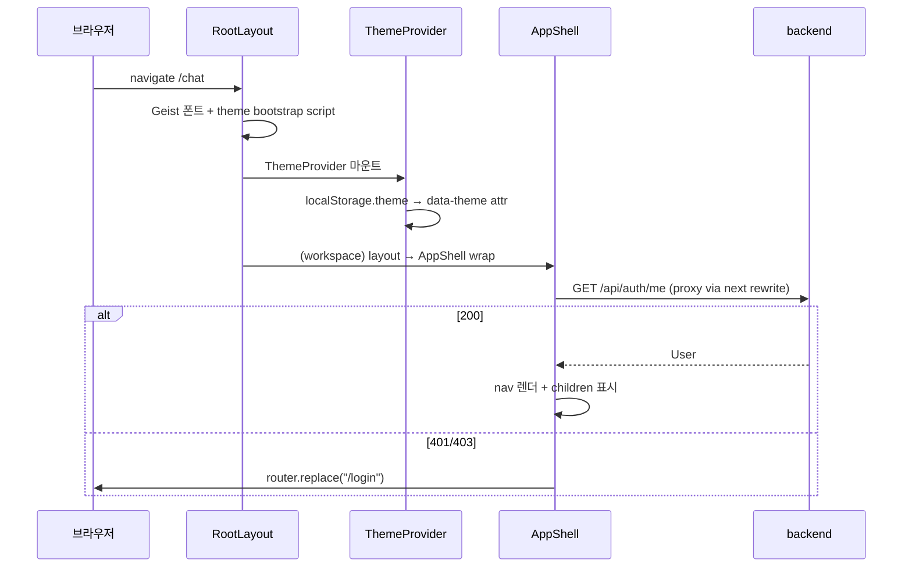

# 프론트 부팅 + AppShell

Next.js App Router 기반. `frontend/app/layout.tsx` 가 루트 레이아웃, 그 아래 `(workspace)` 그룹이 로그인 후 페이지를 묶고, `AppShell` 컴포넌트가 nav · 헤더 · 인증 가드를 한 곳에서 처리합니다.

## 1. 디렉토리 구조

```
frontend/
  app/
    layout.tsx                 # 루트 레이아웃 (font / theme boot)
    page.tsx                   # / — 토큰 있으면 /chat, 없으면 /login
    login/page.tsx
    register/page.tsx
    manual/page.tsx            # 로그인 전 인트로
    (workspace)/               # 로그인 후 페이지 그룹 — AppShell 적용
      layout.tsx               # AppShell wrap
      chat/page.tsx
      chatbots/page.tsx
      ...
      guide/page.tsx           # 인서비스 종합 매뉴얼
  features/                    # 도메인별 컴포넌트
    workflows/WorkflowCanvas.tsx · WorkflowCanvas3D.tsx
    notices/NoticeMiniList.tsx
    usage/UsageMiniCard.tsx
  shared/
    layout/AppShell.tsx
    lib/api.ts · userError.ts
    theme/...
    ui/...                     # 기본 컴포넌트 (Alert, EmptyState, PageHeader…)
```

## 2. 부팅 흐름



## 3. AppShell (`shared/layout/AppShell.tsx`)

핵심 책임:
1. **토큰 가드** — `getToken()` 없으면 즉시 `/login`.
2. **현재 사용자 fetch** — `GET /auth/me`, 401/403 시 token 삭제 + 로그인 페이지.
3. **navigation** — 페이지 경로 활성 표시는 `activeLinkStyle` (color-mix 14% accent — 모든 테마에서 명도대비 안전).
4. **chat 페이지에서만 헤더 숨김** — 채팅은 전체 화면, 상단 우측에 플로팅 미니 nav.
5. **에러 / 부팅 화면** — bootError 시 다시 시도 버튼.

```tsx
useEffect(() => {
  const t = getToken();
  if (!t) { router.replace("/login"); return; }
  setBootError(null);
  apiFetch("/auth/me").then(r => r.json()).then(setMe).catch(e => {
    if (e instanceof ApiUserError) {
      if (e.status === 401 || e.status === 403) { clearToken(); router.replace("/login"); return; }
      if (e.status === 0) { setBootError(e.message); return; }
    }
    setBootError(messageFromUnknownError(e));
  });
}, [router]);
```

## 4. RBAC nav 가드

```tsx
const canAudit = me?.role === "team_auditor" || me?.role === "team_admin" || me?.role === "super_admin";
const canManageTeam = me?.role === "team_admin" || me?.role === "super_admin";
const isSuperAdmin = me?.role === "super_admin";

{canAudit && <Link href="/team">감사</Link>}
{canManageTeam && <Link href="/admin">{isSuperAdmin ? "시스템" : "관리"}</Link>}
```

서버 가드(`get_current_user` + `require_role`) 가 최종 권위지만, 프론트 nav 에서도 안 보이게 해서 UX 가 깨끗.

## 5. linkCls 의 활성 표시 가드

```tsx
const activeLinkStyle = {
  background: "color-mix(in oklch, var(--accent) 14%, transparent)",
  color: "var(--accent)",
} as const;
```

처음엔 `var(--accent-soft)` 토큰을 썼지만, 일부 테마(BMW Light, Apple)에서 불투명한 흰색이 깔리며 글자가 사라지는 버그가 있었음. **인라인 color-mix 로 항상 accent 의 14% 톤** 으로 강제해 모든 테마에서 명도대비 안전.

## 6. 함정·결정

- **AppShell 은 client component** — `"use client"` 첫 줄. SSR 안 함 (브라우저의 localStorage 가 필요).
- **chat 페이지의 헤더 숨김** — `isChat = pathname === "/chat"` 체크. 다른 페이지로 이동하면 헤더가 다시 나옴.
- **boot 중 LoadingState 가 단순** — animate-pulse 스피너 한 줄. 깔끔.
- **외부 IP 접속 대응** — 헤더의 BrandThemeGallery 가 localStorage 의 theme 키를 즉시 반영하지만, 외부 사용자(다른 PC) 가 처음 접속 시엔 light 기본. theme bootstrap script 가 `app/layout.tsx` 의 `<head>` 안에 인라인.

## 관련 문서

- API 클라이언트 — [frontend-api](frontend-api.md)
- 테마 시스템 — [frontend-theme](frontend-theme.md)
- /guide (이 워크스루의 인서비스 버전) — `frontend/app/(workspace)/guide/page.tsx`
