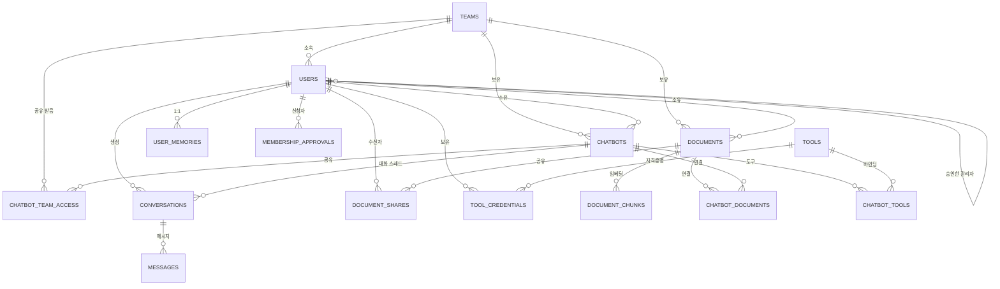
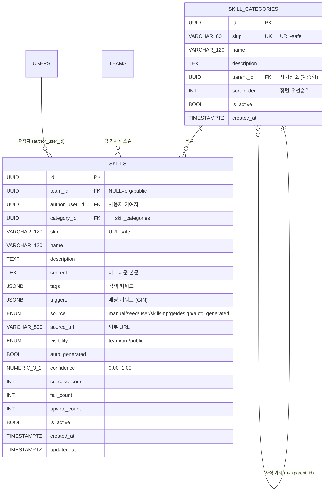
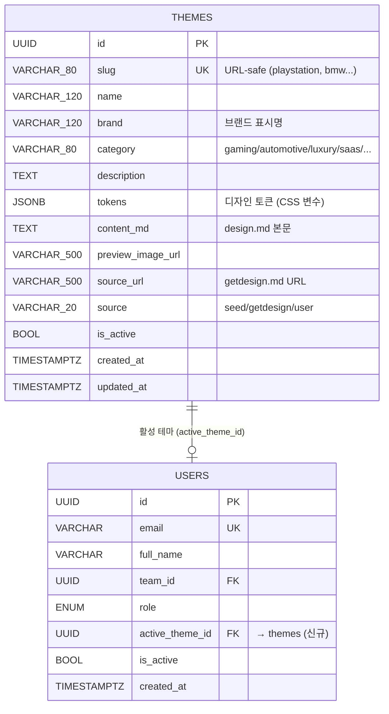
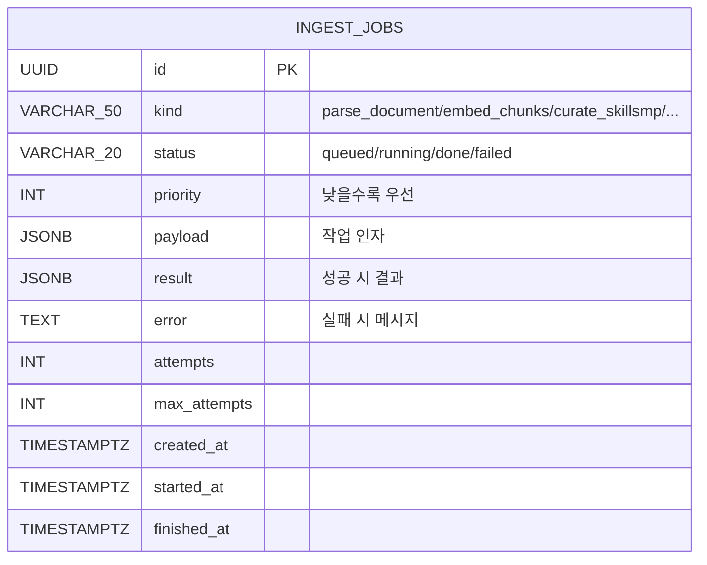
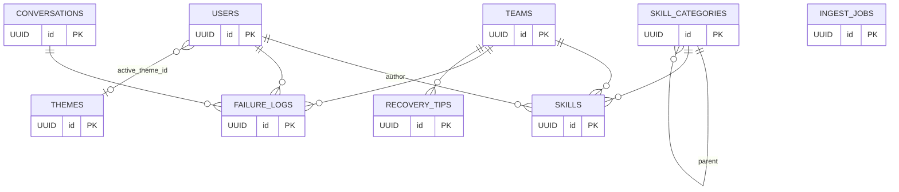
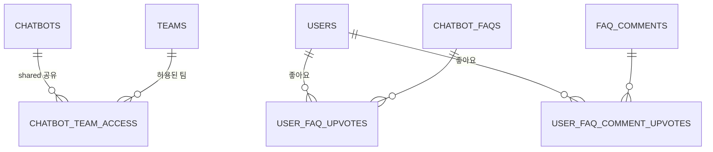

# ERD (Entity Relationship Diagram)

> 범례: **[굵은 글씨]** = PK, *italic* = FK, `#` = UNIQUE, `*` = NOT NULL

## 테이블 관계 (Mermaid)



> `CHATBOT_TEAM_ACCESS`는 **교차팀 공유** 확장에서 신설되는 테이블입니다. 설계는 [chatbot_sharing.md](./chatbot_sharing.md)를 참조하세요.

## 기존 테이블 (변경점 포함)

### teams
| 컬럼 | 타입 | 제약 | 비고 |
| ---- | ---- | ---- | ---- |
| **id** | UUID | PK | |
| name | String(200) | * | |
| slug | String(120) | `#` * | URL safe |
| invite_code | String(64) | `#` * | 팀장이 로테이트 가능 |
| created_by_user_id | UUID *FK users.id* | nullable | **신규** — super_admin 생성 시 기록 |
| created_at | DateTime | * | |

### users
| 컬럼 | 타입 | 제약 | 비고 |
| ---- | ---- | ---- | ---- |
| **id** | UUID | PK | |
| email | String(320) | `#` * | index |
| hashed_password | String(255) | * | bcrypt |
| full_name | String(200) | * | |
| *team_id* | UUID FK teams.id | nullable | |
| role | Enum `UserRole` | * | **확장** — super_admin / team_admin / team_auditor / team_member |
| approval_status | Enum `ApprovalStatus` | * default=pending | **신규** — pending / approved / rejected |
| invited_by_user_id | UUID FK users.id | nullable | **신규** — 초대한 팀장 |
| is_active | Boolean | * default=true | |
| active_theme_id | UUID FK themes.id | nullable | 활성 디자인 테마 |
| level | Integer | * default=0 | **신규** — 게임화 레벨 overall 1~40 (0=미초기화). XP=대화+제작물×15+받은좋아요×8+문서×3 로 `/stats/me/level` 에서 산정·저장 |
| level_reached_at | DateTime(tz) | nullable | **신규** — 마지막 *레벨업* 시각. 공지 피드가 최근 7일 레벨업을 "○○님이 중급 Lv.1 달성!" 으로 노출 |
| created_at | DateTime | * | |

> **레거시 호환**: 기존 enum 값 `member` 는 의미상 `team_member`로 표시됩니다. 마이그레이션 시 `UserRole` enum 값은 보존하고 alias(`team_member = member`)를 두는 전략을 사용합니다.

### documents
| 컬럼 | 타입 | 제약 | 비고 |
| ---- | ---- | ---- | ---- |
| **id** | UUID | PK | |
| *team_id* | UUID FK teams.id | * | |
| *owner_user_id* | UUID FK users.id | * | |
| scope | Enum `DocumentScope` | * | team / personal |
| storage_path | String(1024) | * | 절대 경로 |
| original_filename | String(512) | * | |
| mime_type | String(200) | | |
| byte_size | Integer | default 0 | |
| status | Enum `DocumentStatus` | * | processing / ready / failed |
| error_message | Text | | 파서/임베딩 오류 메시지 |
| created_at | DateTime | * | |

### document_chunks (CASCADE from documents)
| 컬럼 | 타입 | 제약 | 비고 |
| ---- | ---- | ---- | ---- |
| **id** | UUID | PK | |
| *document_id* | UUID FK documents.id | * | ON DELETE CASCADE |
| chunk_index | Integer | * | 0-based |
| content | Text | * | 원문 청크 |
| content_tsv | TSVECTOR | computed, GIN index | lexical search |
| meta | JSONB | default `'{}'` | `{filename, page?, ...}` |
| embedding | Vector(1536) | * , HNSW index (m=16, ef=64, cosine) | OpenAI text-embedding-3-large |

### document_shares
| 컬럼 | 타입 | 제약 | 비고 |
| ---- | ---- | ---- | ---- |
| **id** | UUID | PK | |
| *document_id* | UUID FK documents.id | * | ON DELETE CASCADE |
| *user_id* | UUID FK users.id | * | UNIQUE(document_id, user_id) |
| created_at | DateTime | * | |

### conversations
| 컬럼 | 타입 | 제약 | 비고 |
| ---- | ---- | ---- | ---- |
| **id** | UUID | PK | |
| *user_id* | UUID FK users.id | * | |
| *team_id* | UUID FK teams.id | nullable | |
| *chatbot_id* | UUID FK chatbots.id | nullable | **신규** — 소속 챗봇 |
| title | String(500) | | 자동 생성 |
| model_id | String(200) | * | LLM ID |
| created_at / updated_at | DateTime | * | |

### messages (CASCADE from conversations)
| 컬럼 | 타입 | 제약 | 비고 |
| ---- | ---- | ---- | ---- |
| **id** | UUID | PK | |
| *conversation_id* | UUID FK conversations.id | * | ON DELETE CASCADE |
| role | String(32) | * | user / assistant / system / tool |
| content | Text | * | |
| extra | JSONB | | 이미지 메타 등 |
| created_at | DateTime | * | |

### user_memories
| 컬럼 | 타입 | 제약 | 비고 |
| ---- | ---- | ---- | ---- |
| **id** | UUID | PK | |
| *user_id* | UUID FK users.id | `#` * | 1:1 |
| content | Text | default `''` | LLM 요약본 |
| updated_at | DateTime | * | |

---

## 신규 테이블

### chatbots
| 컬럼 | 타입 | 제약 | 비고 |
| ---- | ---- | ---- | ---- |
| **id** | UUID | PK | |
| *team_id* | UUID FK teams.id | * | |
| *owner_user_id* | UUID FK users.id | * | |
| name | String(200) | * | |
| description | Text | | |
| visibility | Enum `ChatbotVisibility` | * default=private | private / public / shared |
| system_prompt | Text | default `''` | |
| model_id | String(200) | * | `openai/gpt-5.5` 등 |
| use_rag | Boolean | * default=true | |
| rag_scope | Enum `ChatbotRagScope` | * default=linked_only | linked_only / owner_visible / team_all |
| vectorstore_partition | String(64) | nullable | 향후 파티셔닝 키 |
| created_at / updated_at | DateTime | * | |

**인덱스**: `(team_id, visibility)`, `(owner_user_id)`

### chatbot_documents
| 컬럼 | 타입 | 제약 | 비고 |
| ---- | ---- | ---- | ---- |
| **id** | UUID | PK | |
| *chatbot_id* | UUID FK chatbots.id | * | ON DELETE CASCADE |
| *document_id* | UUID FK documents.id | * | ON DELETE CASCADE |
| created_at | DateTime | * | UNIQUE(chatbot_id, document_id) |

### tools
| 컬럼 | 타입 | 제약 | 비고 |
| ---- | ---- | ---- | ---- |
| **id** | UUID | PK | |
| slug | String(64) | `#` * | `gmail.send`, `web_search` 등 |
| display_name | String(200) | * | |
| description | Text | | |
| category | String(64) | * | communication / search / data / productivity |
| kind | Enum `ToolKind` | * | builtin / http / oauth / mcp |
| parameters_schema | JSONB | default `'{}'` | JSON Schema |
| default_config | JSONB | default `'{}'` | `endpoint` 필드는 SSRF 가드 통과 후 저장 |
| requires_credentials | Boolean | * default=false | |
| icon_url | String(1024) | | |
| is_active | Boolean | * default=true | |
| author_user_id | UUID FK users.id NULL | | 사용자 커스텀 도구 작성자 (PR2 보안 정책) |
| team_id | UUID FK teams.id NULL | | 사용자 도구의 소속 팀 |
| source | Enum `ToolSource` | * default=system | `system` / `user` |
| visibility | Enum `ToolVisibility` | * default=private | `private` (작성자만) / `team` (팀장+ 등록 필요) / `public` (팀장+ 등록 필요) |
| upvote_count | Integer | * default=0 | `UserToolUpvote` aggregate |
| created_at | DateTime | * | |

> **보안**: `POST /tools/custom` · `PATCH /tools/{id}` 의 `endpoint` 는 `app/core/ssrf.py:assert_safe_url` 를 통과해야 하고, `visibility=team/public` 으로 등록·승격하려면 `team_admin` 이상이어야 합니다. 자세한 내용은 `docs/api.md` 의 Tools 섹션 참조.

### chatbot_tools
| 컬럼 | 타입 | 제약 | 비고 |
| ---- | ---- | ---- | ---- |
| **id** | UUID | PK | |
| *chatbot_id* | UUID FK chatbots.id | * | ON DELETE CASCADE |
| *tool_id* | UUID FK tools.id | * | |
| enabled | Boolean | * default=true | |
| config | JSONB | default `'{}'` | override default_config |
| created_at | DateTime | * | UNIQUE(chatbot_id, tool_id) |

### tool_credentials
| 컬럼 | 타입 | 제약 | 비고 |
| ---- | ---- | ---- | ---- |
| **id** | UUID | PK | |
| *tool_id* | UUID FK tools.id | * | |
| *user_id* | UUID FK users.id | * | UNIQUE(tool_id, user_id) |
| *team_id* | UUID FK teams.id | nullable | team-level 자격증명 지원 |
| data | JSONB | * | `{access_token, refresh_token, ...}` — at-rest 암호화 권장 |
| valid_until | DateTime | | |
| created_at / updated_at | DateTime | * | |

### membership_approvals (선택)
간단한 구현에서는 `users.approval_status`만으로 충분하지만, 감사 로그가 필요하면 이 테이블을 사용합니다.

| 컬럼 | 타입 | 제약 | 비고 |
| ---- | ---- | ---- | ---- |
| **id** | UUID | PK | |
| *user_id* | UUID FK users.id | * | |
| *team_id* | UUID FK teams.id | * | |
| status | Enum `ApprovalStatus` | * default=pending | |
| decided_by_user_id | UUID FK users.id | nullable | |
| decided_at | DateTime | nullable | |
| note | Text | | |
| created_at | DateTime | * | |

---

## 인덱스 · 성능 전략

### 현행
- `document_chunks.embedding` — HNSW (`m=16, ef_construction=64`, cosine) — 밀집 벡터 ANN
- `document_chunks.content_tsv` — GIN — 어휘 검색
- `users.email` — B-tree unique
- `teams.slug`, `teams.invite_code` — B-tree unique

### 신규(추가 권장)
- `chatbots (team_id, visibility)` — 팀별 공개 챗봇 리스트 빠른 조회
- `chatbot_documents (chatbot_id)` — 챗봇별 문서 스코프 조인
- `chatbot_tools (chatbot_id)` — 챗봇별 도구 로드
- `tool_credentials (user_id, tool_id)` — 인증 조회

### 챗봇별 검색 가속화
기본 쿼리는 다음과 같이 사전 필터 후 HNSW를 사용합니다:

```sql
WITH scoped_docs AS (
 SELECT cd.document_id
 FROM chatbot_documents cd
 WHERE cd.chatbot_id = :chatbot_id
)
SELECT dc.id
 FROM document_chunks dc
 JOIN scoped_docs sd ON sd.document_id = dc.document_id
 ORDER BY dc.embedding <-> :query_embedding -- HNSW
 LIMIT :k;
```

`scoped_docs`가 작을수록 HNSW 탐색 비용이 줄어듭니다. `rag_scope=team_all`일 때는 팀 전체 문서를 보므로 기존 쿼리와 동일.

### 수평 확장: 파티셔닝
데이터가 커지면 (>1M chunks) 다음 전략을 검토:

```sql
-- 예시: team_id 해시 파티셔닝
CREATE TABLE document_chunks (
 id UUID PRIMARY KEY,
 team_id UUID NOT NULL, -- 파티션 키용으로 추가
 document_id UUID NOT NULL,
 chunk_index INT NOT NULL,
 content TEXT NOT NULL,
 content_tsv TSVECTOR,
 meta JSONB,
 embedding VECTOR(1536)
) PARTITION BY HASH (team_id);

CREATE TABLE document_chunks_p0 PARTITION OF document_chunks FOR VALUES WITH (MODULUS 8, REMAINDER 0);
-- ... p7 까지
```

각 파티션에 독립적인 HNSW 인덱스를 생성하여 병렬 검색이 가능합니다.

### 벡터스토어 생성/삭제 동기화
- INSERT 경로: `documents.upload` → `process_document_job` → `document_chunks` INSERT
- DELETE 경로: `DELETE /documents/{id}` → SQLAlchemy ORM이 `ON DELETE CASCADE`로 `document_chunks`, `document_shares`, `chatbot_documents` 자동 제거
- 코드 상 `Document.chunks`, `Document.shares` 관계에 `cascade="all, delete-orphan"` 설정

---

## Enum 정의

```python
class UserRole(str, enum.Enum):
 super_admin = "super_admin"
 team_admin = "team_admin"
 team_auditor = "team_auditor"
 team_member = "team_member" # 레거시 DB에 "member" 값이 있으면 alias로 처리

class ApprovalStatus(str, enum.Enum):
 pending = "pending"
 approved = "approved"
 rejected = "rejected"

class DocumentScope(str, enum.Enum):
 team = "team"
 personal = "personal"

class DocumentStatus(str, enum.Enum):
 processing = "processing"
 ready = "ready"
 failed = "failed"

class ChatbotVisibility(str, enum.Enum):
 private = "private" # 오너만 사용
 public = "public" # 같은 팀 전체가 사용
 shared = "shared" # 같은 팀 + chatbot_team_access 에 등록된 추가 팀

class ChatbotRagScope(str, enum.Enum):
 linked_only = "linked_only" # chatbot_documents에 연결된 문서만
 owner_visible = "owner_visible" # 오너가 볼 수 있는 문서 모두(team+personal+shared)
 team_all = "team_all" # 팀 전체 문서

class ToolKind(str, enum.Enum):
 builtin = "builtin" # Python in-process 구현
 http = "http" # URL 호출 (Webhook/REST)
 oauth = "oauth" # OAuth 기반 (Gmail 등)
 mcp = "mcp" # MCP 서버
```

---

## 마이그레이션 메모

- 기존 `member` enum 값이 DB에 남아있을 수 있습니다. SQLAlchemy `Enum`은 `values_callable`로 값 리스트를 명시하거나 `ALTER TYPE`으로 확장합니다.
- `document_chunks` → `document_id` FK는 이미 CASCADE이므로 문서 삭제 시 청크도 삭제됩니다(OR 관계에 cascade 추가 필요 — [document_rag.md](./document_rag.md) 참조).
- 신규 테이블은 lifespan의 `Base.metadata.create_all`로 자동 생성되나, 운영 환경에서는 Alembic 마이그레이션을 권장합니다(현재 리포에 alembic 디렉토리 미존재 — 추후 추가 필요).
- **`create_all` 은 기존 테이블에 컬럼/인덱스를 추가하지 않음**. 새 컬럼 추가 시 ALTER TABLE 수동 또는 Alembic 마이그레이션 필요. 예: `users.active_theme_id` 추가 시 `ALTER TABLE users ADD COLUMN IF NOT EXISTS active_theme_id UUID REFERENCES themes(id) ON DELETE SET NULL;`

---

# 부록 A — Skills 마켓플레이스 (신규)



## 컬럼 설명 (skill_categories)

| 컬럼 | 타입 | 설명 |
|---|---|---|
| id | UUID PK | 기본키 |
| slug | VARCHAR(80) UNIQUE | URL-safe 식별자 (`korean-business`, `development-backend`) |
| name | VARCHAR(120) | 표시 이름 (예: "한국 비즈니스") |
| description | TEXT | 한 줄 설명 |
| parent_id | UUID FK (self) | 부모 카테고리 (자기참조 — 계층형 트리) |
| sort_order | INT (default 100) | 낮을수록 위 |
| is_active | BOOL | 비활성 시 UI 에서 숨김 |

## 컬럼 설명 (skills)

| 컬럼 | 타입 | 설명 |
|---|---|---|
| id | UUID PK | 기본키 |
| team_id | UUID FK NULL | 팀 가시성. NULL 이면 org/public |
| author_user_id | UUID FK NULL | 사용자가 등록한 경우 작성자 |
| category_id | UUID FK NULL | skill_categories 의 id |
| slug | VARCHAR(120) | URL-safe (예: `dev-fastapi-async-best`) |
| name | VARCHAR(120) NOT NULL | 표시 이름 |
| description | TEXT | 카드 카피 |
| content | TEXT NOT NULL | 마크다운 본문 — LLM 시스템 프롬프트에 주입됨 |
| tags | JSONB | `["fastapi","async"]` — GIN 인덱스 |
| triggers | JSONB | 매칭용 키워드 — GIN 인덱스, 사용자 쿼리와 overlap 점수 |
| source | ENUM | `manual`/`seed`/`user`/`skillsmp`/`getdesign`/`auto_generated` |
| source_url | VARCHAR(500) | 외부 출처 URL (skillsmp.com 등) |
| visibility | ENUM | `team`/`org`/`public` |
| auto_generated | BOOL | LLM 이 자동 생성했는지 |
| confidence | NUMERIC(3,2) | 0.00 ~ 1.00 (자동 생성 신뢰도) |
| success_count / fail_count | INT | 사용 후 사용자 피드백 (스킬 효과 추적) |
| upvote_count | INT | 커뮤니티 좋아요 |
| is_active | BOOL | soft delete |

**인덱스** (GIN 포함):
- `ix_skills_team_active (team_id, is_active)` — 가시성 필터 가속
- `ix_skills_category (category_id)`
- `ix_skills_source (source)` · `ix_skills_visibility (visibility)`
- `ix_skills_triggers_gin (triggers)` GIN · `ix_skills_tags_gin (tags)` GIN

---

# 부록 B — Themes (신규)



## 컬럼 설명 (themes)

| 컬럼 | 타입 | 설명 |
|---|---|---|
| id | UUID PK | 기본키 |
| slug | VARCHAR(80) UNIQUE | URL-safe (`playstation`, `bmw`, `apple`, `default`) |
| name | VARCHAR(120) | 표시 이름 |
| brand | VARCHAR(120) | 원래 브랜드명 (예: "PlayStation") |
| category | VARCHAR(80) | `gaming`/`automotive`/`luxury-tech`/`developer-tools`/`fintech`/`corporate` |
| description | TEXT | 한 줄 설명 |
| **tokens** | JSONB | 핵심. `{"colors":{"primary":"#0070d1",...},"typography":{...},"radius":{...},"motion":{...}}` |
| content_md | TEXT | design.md 마크다운 (LLM 이 "BMW 스타일 카드 만들어줘" 같은 요청에 참조) |
| preview_image_url | VARCHAR(500) | 카드 썸네일 |
| source_url | VARCHAR(500) | 외부 (getdesign.md) URL |
| source | VARCHAR(20) | `seed`/`getdesign`/`user` |
| is_active | BOOL | 비활성 시 목록에서 제외 |

## 컬럼 설명 (users 신규)

| 컬럼 | 타입 | 설명 |
|---|---|---|
| active_theme_id | UUID FK NULL | 사용자의 현재 활성 테마 (themes.id). NULL 이면 `default` |

 이 컬럼은 **기존 운영 DB 에 자동 추가되지 않음**:
```sql
ALTER TABLE users ADD COLUMN IF NOT EXISTS active_theme_id UUID
 REFERENCES themes(id) ON DELETE SET NULL;
```

---

# 부록 C — Self-Improvement (실패 학습)

```mermaid
erDiagram
 TEAMS ||--o{ FAILURE_LOGS : "실패 기록"
 TEAMS ||--o{ RECOVERY_TIPS : "복구 팁"
 USERS ||--o{ FAILURE_LOGS : "실패한 사용자"
 CONVERSATIONS ||--o{ FAILURE_LOGS : "발생 대화"

 FAILURE_LOGS {
 UUID id PK
 UUID team_id FK
 UUID user_id FK NULL
 UUID conversation_id FK NULL
 VARCHAR_40 category "error_taxonomy 결과"
 VARCHAR_64 signature "sha256[:16] dedup"
 JSONB tool_sequence "호출된 도구 순서"
 TEXT error_summary
 JSONB prompt_keywords "쿼리 추출 키워드"
 TIMESTAMPTZ created_at
 }

 RECOVERY_TIPS {
 UUID id PK
 UUID team_id FK
 TEXT condition "언제 적용할지"
 TEXT action "어떻게 할지"
 JSONB prompt_keywords "매칭 키워드"
 INT usage_count
 INT success_count
 NUMERIC_3_2 confidence "success/usage"
 JSONB source_failure_ids "파생 실패 ID"
 BOOL is_active
 TIMESTAMPTZ created_at
 TIMESTAMPTZ updated_at
 }
```

## 컬럼 설명 (failure_logs)

| 컬럼 | 타입 | 설명 |
|---|---|---|
| id | UUID PK | 기본키 |
| team_id | UUID FK | 팀 격리 |
| user_id | UUID FK NULL | 실패 시점 사용자 |
| conversation_id | UUID FK NULL | 발생한 대화 |
| category | VARCHAR(40) | `dependency`/`syntax`/`timeout`/... (`backend/app/services/error_taxonomy.py`) |
| signature | VARCHAR(64) | sha256(cat + snippet + tools)[:16] — dedup |
| tool_sequence | JSONB | `["stock_price","code_interpreter"]` 호출 순서 |
| error_summary | TEXT | 최대 2000자 |
| prompt_keywords | JSONB | 사용자 쿼리에서 추출한 토큰 |

## 컬럼 설명 (recovery_tips)

| 컬럼 | 타입 | 설명 |
|---|---|---|
| id | UUID PK | 기본키 |
| team_id | UUID FK | 팀 격리 |
| condition | TEXT | 자연어 ("주식 종목 조회 실패 + 한글 회사명") |
| action | TEXT | 자연어 ("종목 코드 6자리 요청") |
| prompt_keywords | JSONB | GIN 인덱스 매칭용 |
| usage_count / success_count | INT | 시스템 프롬프트 주입 / 성공 횟수 |
| confidence | NUMERIC(3,2) | success/usage. 0.4 미만은 비활성 |
| source_failure_ids | JSONB | 어떤 FailureLog 들로부터 파생됐는지 |

---

# 부록 D — Ingest Jobs (외재화 워커 큐)



| 컬럼 | 타입 | 설명 |
|---|---|---|
| id | UUID PK | 기본키 |
| kind | VARCHAR(50) | `parse_document`/`embed_chunks`/`curate_skillsmp`/`curate_getdesign`/`gen_recovery_tip` |
| status | VARCHAR(20) | `queued`/`running`/`done`/`failed` |
| priority | INT | 0=최우선, 100=기본 |
| payload | JSONB | `{"document_id":"..."}` 등 |
| result | JSONB | 성공 시 결과 요약 |
| error | TEXT | 실패 메시지 |
| attempts / max_attempts | INT | 재시도 카운터 (기본 3) |

**인덱스**: `(status, priority)`, `kind` 단일.

**워커 가이드**: 리포 루트의 `worker/README.md`

---

# 부록 E — 신규 영역 통합 관계도



신규 6개 테이블 + `users.active_theme_id` FK 추가. 기존 테이블 영향 없음.

---

## 2026-06 스키마 변경

이번 정비에서 추가/변경된 테이블·컬럼·enum. (`schema_upgrade.ensure_schema_upgrades` 가 기존 DB 에 멱등 적용; 신규 테이블은 `Base.metadata.create_all` 이 생성)

### enum
- `ChatbotVisibility` 에 `shared` 추가 — `ALTER TYPE chatbotvisibility ADD VALUE IF NOT EXISTS 'shared'`.

### chatbot_team_access (신규) — 교차팀 공유 허용 팀
| 컬럼 | 타입 | 제약 | 비고 |
| ---- | ---- | ---- | ---- |
| id | UUID | PK | |
| chatbot_id | UUID | * FK chatbots.id ON DELETE CASCADE | |
| team_id | UUID | * FK teams.id ON DELETE CASCADE | |
| created_at | DateTime(tz) | server_default now() | |

제약: UNIQUE(chatbot_id, team_id) = `uq_chatbot_team_access` · 인덱스 (chatbot_id), (team_id). `granted_by` 컬럼 없음.

### documents.folder (신규 컬럼) — 사용자 폴더 트리(#9)
| 컬럼 | 타입 | 제약 | 비고 |
| ---- | ---- | ---- | ---- |
| folder | VARCHAR(512) | NOT NULL DEFAULT '' | 가상 경로(예: `인사/2026`), '' = 미분류(루트). 디스크 적재도 이 경로 |

### user_faq_upvotes / user_faq_comment_upvotes (신규) — FAQ 좋아요 dedup·토글
| 컬럼 | 타입 | 제약 |
| ---- | ---- | ---- |
| user_id | UUID | PK · FK users.id CASCADE |
| faq_id / comment_id | UUID | PK · FK chatbot_faqs.id / faq_comments.id CASCADE |
| created_at | DateTime(tz) | server_default now() |

### 제거
- `chatbots.vectorstore_partition` (미사용 컬럼, ORM 매핑 삭제 — 기존 DB 컬럼은 무해하게 잔존 가능).


