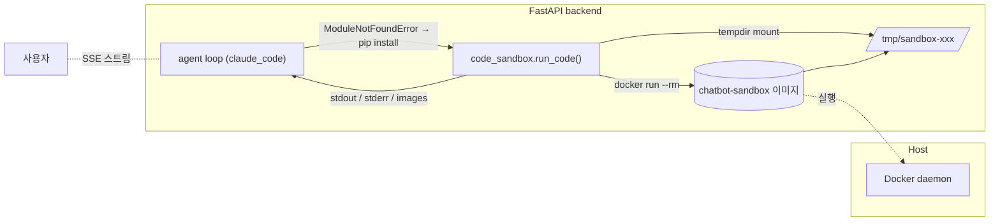
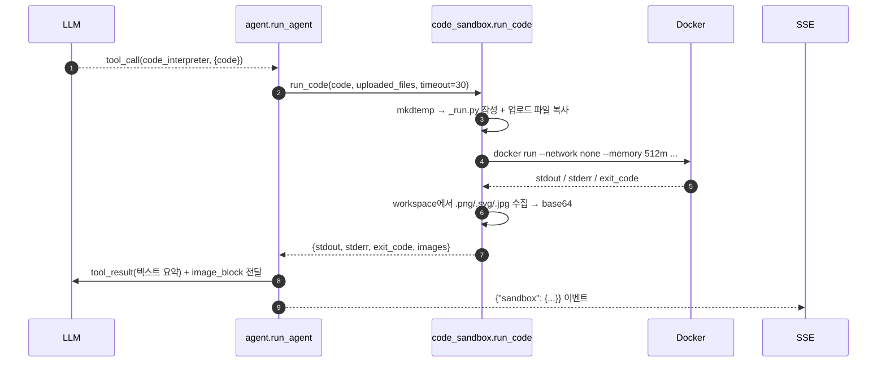
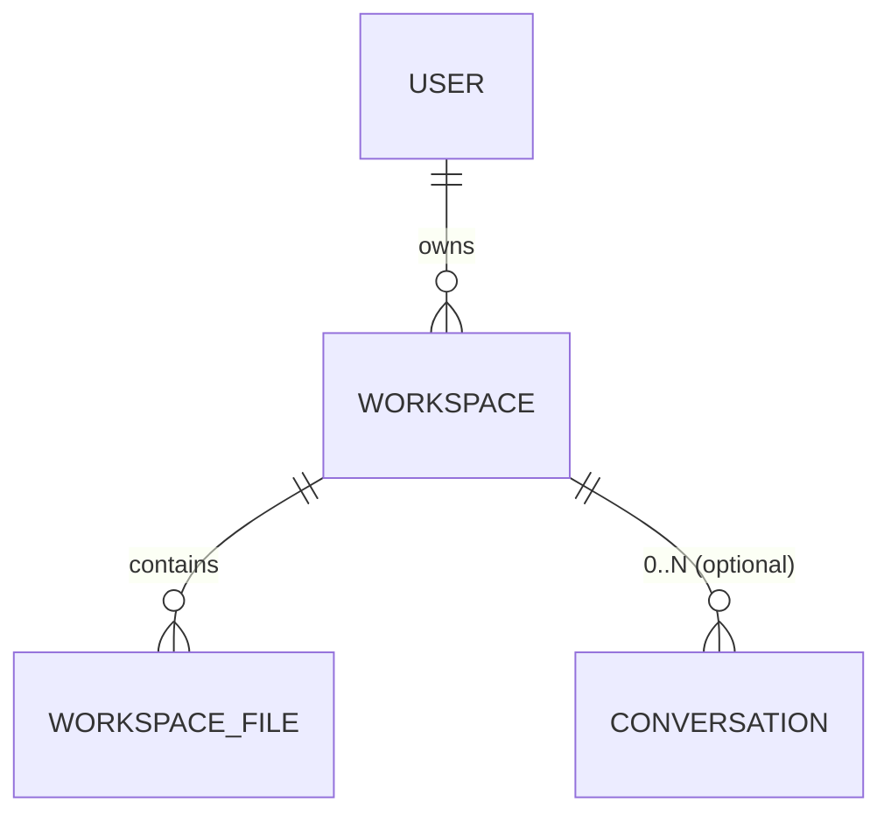
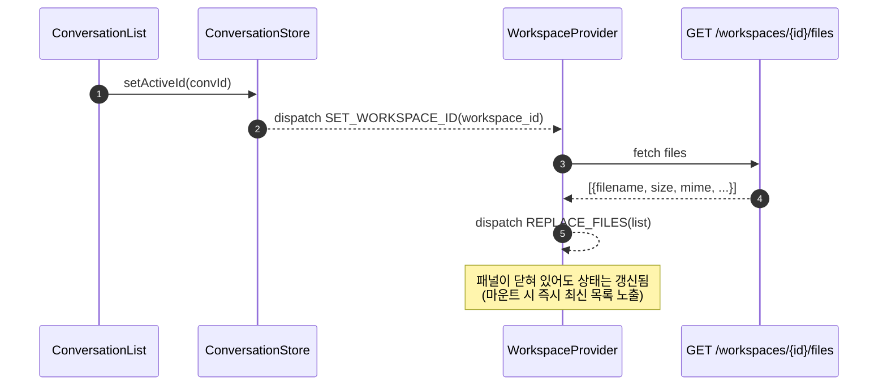

# 코드 샌드박스 구조

> **개발 전용(운영 미노출)** — 이 샌드박스(`code_sandbox.run_code`)는 ADR-0005 로 폐기된 `code_interpreter` 가 아니라, 현재는 `claude_code` 에이전트 루프의 자동 pip-install 재시도 헬퍼(`agent.py`, ModuleNotFoundError 복구)로 사용됩니다. `claude_code` 는 ADR-0009 개발 티어 전용이라 운영(`FEATURE_CLAUDE_CODE=off`)에서는 호출 경로 자체가 없습니다. 컨테이너에서 Python 코드를 격리 실행해 결과(stdout/이미지)를 다시 LLM 에 되먹입니다.

## 1. 전체 그림



## 2. 컨테이너 이미지 (`backend/sandbox/Dockerfile`)

- 베이스: `python:3.11-slim`
- 시스템 패키지: gcc/g++/libffi/libxml2/libxslt/ghostscript/fontconfig
- **나눔고딕** 한글 폰트를 직접 설치(`/usr/share/fonts/truetype/nanum`) → matplotlib 한글 깨짐 방지
- 기본 파이썬 패키지 (과학계산/시각화/문서 생성):
 - 데이터: `pandas numpy scipy scikit-learn statsmodels sympy`
 - 시각화: `matplotlib seaborn plotly bokeh altair wordcloud`
 - 오피스: `openpyxl xlsxwriter xlrd python-docx python-pptx reportlab`
 - 네트워크(런타임은 차단되지만 파서용으로 포함): `requests httpx beautifulsoup4 lxml`
 - 유틸: `tabulate pyyaml toml jsonschema networkx Pillow faker tqdm`
 - 보안/시간: `cryptography python-dateutil pytz`
 - SVG: `cairosvg svgwrite`
- `MPLBACKEND=Agg` — 헤드리스 matplotlib
- 전용 유저 `sandbox`로 권한 낮춤 (`USER sandbox`)

빌드:

```bash
docker build -t chatbot-sandbox backend/sandbox
```

## 3. 실행 래퍼 (`backend/app/services/code_sandbox.py`)

```python
cmd = [
 "docker", "run", "--rm",
 "--name", f"sandbox-{run_id}",
 "--network", "none",                          # 네트워크 완전 차단
 "--memory", f"{settings.sandbox_memory_mb}m",  # OOM 방지
 "--cpus", str(settings.sandbox_cpus),          # CPU 코어 제한
 "--pids-limit", str(settings.sandbox_pids_limit),  # fork 폭탄 방지
 "--read-only",                                 # rootfs 읽기 전용
 "--cap-drop", "ALL",                           # 모든 리눅스 capability 제거
 "--security-opt", "no-new-privileges",         # 권한 상승 차단
 "--user", "65534:65534",                       # nobody 로 실행
 "--tmpfs", "/tmp:rw,noexec,nosuid,size=64m",   # 쓰기 가능 임시 영역(실행 금지)
 "-v", f"{workspace}:/workspace:rw",
 "chatbot-sandbox",
 "python", "/workspace/_run.py",
]
# sandbox_runtime_class != "runc" 이면 cmd 에 --runtime <class>-runtime 삽입(예: kata-runtime)
```

| 경계 | 값 | 목적 |
| ---- | ---- | ---- |
| 네트워크 | `--network none` | 데이터 유출·웹 호출 차단 |
| 메모리 | 512 MB | 큰 모델 로드·배열 남용 차단 |
| CPU | 1 core | 장시간 루프 방지 |
| 프로세스 수 | 64 | fork 폭탄 방지 |
| 디스크 | tempdir(`/tmp/sandbox-<id>`) → `/workspace` | 실행 종료 시 shutil.rmtree로 삭제 |
| 실행 시간 | 기본 30s, wait_for 타임아웃 시 `docker kill` | 무한 루프 방지 |
| 출력 크기 | stdout 10 KB / stderr 5 KB로 절단 | 로그 오염 방지 |

## 4. 입출력 계약

입력:

```python
await run_code(
 code: str,
 uploaded_files: dict[str, bytes] | None = None, # 사용자가 업로드한 파일을 워크스페이스로 복사
 timeout: int = 30,
)
```

출력:

```python
{
 "stdout": "표준출력 (≤ 10 KB)",
 "stderr": "표준에러 (≤ 5 KB)",
 "exit_code": 0,
 "images": [
 {"filename": "chart.png", "b64": "...", "media_type": "image/png"}
 ],
}
```

`format_code_result(result)`는 위 dict를 LLM에 되먹임할 텍스트로 변환합니다
(오류 시 exit code와 stderr 포함, 이미지가 있으면 별도 안내 라인).

## 5. 실행 시퀀스



## 6. 보안 경계 요약

1. **Docker 격리** — 컨테이너에서만 코드 실행. 호스트 파일시스템은 `-v` 로 마운트한 임시 디렉토리만 접근 가능.
1-1. **rootfs/권한 강화** — `--read-only` + `--cap-drop ALL` + `--security-opt no-new-privileges` + `--user 65534:65534`(nobody) + `--tmpfs /tmp(noexec,nosuid,64m)` 로 컨테이너 권한을 최소화(ADR-0001 Phase 0).
1-2. **native fallback 차단** — `SANDBOX_REQUIRE_DOCKER=true`(운영 기본)이고 Docker 가 없으면 native subprocess 실행을 거부하고 비활성 응답을 반환한다(호스트 RCE 차단). `false` 인 내부 dev 환경에서만 native 경로 허용.
2. **네트워크 차단** — `--network none` 으로 외부 호출 불가(데이터 반출/외부 API 호출 모두 실패).
3. **자원 상한** — 메모리/CPU/PID 제한으로 DoS 회피.
4. **임시 작업공간** — 실행 종료 직후 `shutil.rmtree`로 삭제. 재시도는 항상 새 디렉토리에서.
5. **타임아웃** — `asyncio.wait_for` 후 `docker kill`로 강제 종료.
6. **이미지 신뢰** — `chatbot-sandbox`는 사내에서 빌드한 이미지만 사용(배포 파이프라인에 이미지 빌드 단계 포함, 배포 문서(내부) 참조).
7. **이미지 출력만 수집** — `.png/.jpg/.jpeg/.svg/.gif`만 base64 인코딩. 실행 결과로 생성된 임의 바이너리는 호스트로 유출되지 않음.

## 7. 실패 모드

| 상황 | 징후 | 대응 |
| ---- | ---- | ---- |
| Docker 데몬 미실행 | `docker: command not found` 또는 connection refused | Agent가 stderr 메시지를 그대로 LLM에 전달하고 사용자에게 "환경 문제" 안내 |
| 타임아웃 | exit_code=-1, stderr="실행 시간 초과(30초)" | 사용자에게 재작성 유도 |
| OOM | exit_code=137 (SIGKILL) | "메모리 부족" 안내 |
| 이미지 미빌드 | `Unable to find image 'chatbot-sandbox:latest'` | 배포 파이프라인에서 `docker build` 스텝 누락 확인 |
| 사용자 업로드 경로 충돌 | 동일 파일명 덮어쓰기 | 업로드 시 `doc_id_` 프리픽스로 보장(호스트 경로는 `data/uploads/{team_id}/{doc_id}_name`) |

## 영속 — 대화별 작업공간 복원 (2026-06-04)

샌드박스 실행 결과(파일/이미지)를 대화가 끝나도 다시 꺼낼 수 있도록 **Workspace** 레이어를 추가했습니다. ChatGPT의 "대화별 결과 복원" UX 가 이 구조로 가능합니다.

### 데이터 모델

- **Workspace 는 user-scoped 입니다.**
 - 호스트 경로: `data/workspaces/{uuid}/files/` (워크스페이스마다 격리된 디렉토리)
 - 메타 테이블: `workspace_files` (workspace_id, filename, path, mime, size, created_at, ...)
 - 소유: `workspaces.user_id` — 같은 사용자라면 여러 대화에서 한 워크스페이스를 공유 가능.
- **Conversation.workspace_id 는 옵셔널 N:1.**
 - 한 대화는 0개 또는 1개의 워크스페이스에 묶입니다(없으면 임시 실행).
 - 여러 대화가 같은 `workspace_id` 를 가리킬 수 있습니다(분석 컨텍스트 공유).



### 프론트엔드 복원 흐름

대화 목록에서 사용자가 다른 대화를 선택하면 — UI 컴포넌트의 마운트/언마운트와 무관하게 — 워크스페이스 파일 목록이 즉시 교체됩니다.



핵심 포인트:

1. `activeId` 변경은 **`SET_WORKSPACE_ID` 액션 하나만** 디스패치합니다 — 워크스페이스 ID 가 단일 진실의 원천.
2. `WorkspaceProvider` 가 ID 변경을 구독해서 `GET /workspaces/{id}/files` 를 호출하고 `REPLACE_FILES` 로 전체 교체합니다(증분 머지가 아니라 항상 서버 기준).
3. 워크스페이스 패널 UI 의 마운트 여부와 독립적입니다 — 패널을 닫아둔 상태에서 대화를 바꿔도, 다시 열면 그 대화의 파일이 보입니다.

### 그래서 가능해진 것

- **ChatGPT 식 "대화별 결과 복원"** — 어제 만든 차트/엑셀이 대화를 다시 열기만 하면 그대로 사이드 패널에 떠 있음.
- **대화 간 결과 공유** — 다른 대화에 같은 `workspace_id` 를 묶으면 파일을 공유하면서 분석을 이어갈 수 있음(예: "분석 1차" / "분석 2차" 대화가 같은 데이터셋 위에서 동작).
- **샌드박스 임시성과 분리** — 컨테이너 tempdir 은 여전히 매 실행마다 `rmtree` 되지만, 결과물(이미지/csv 등)은 워크스페이스로 승격되어 영속됩니다.

## 8. 향후 확장 후보

- **gVisor / Kata / Firecracker** — 커널 공격면 축소가 필요하면 러ntime 교체.
- **Seccomp / AppArmor 프로필** — 시스템콜 화이트리스트.
- **읽기 전용 FS** — `--read-only` + `--tmpfs /workspace` 전환.
- **지속 워크스페이스** — 사용자 세션 단위로 디렉토리를 유지해 연속 분석 지원.
- **GPU 샌드박스** — 대규모 로컬 모델 추론용 별도 이미지 + `--gpus all` 옵션.
